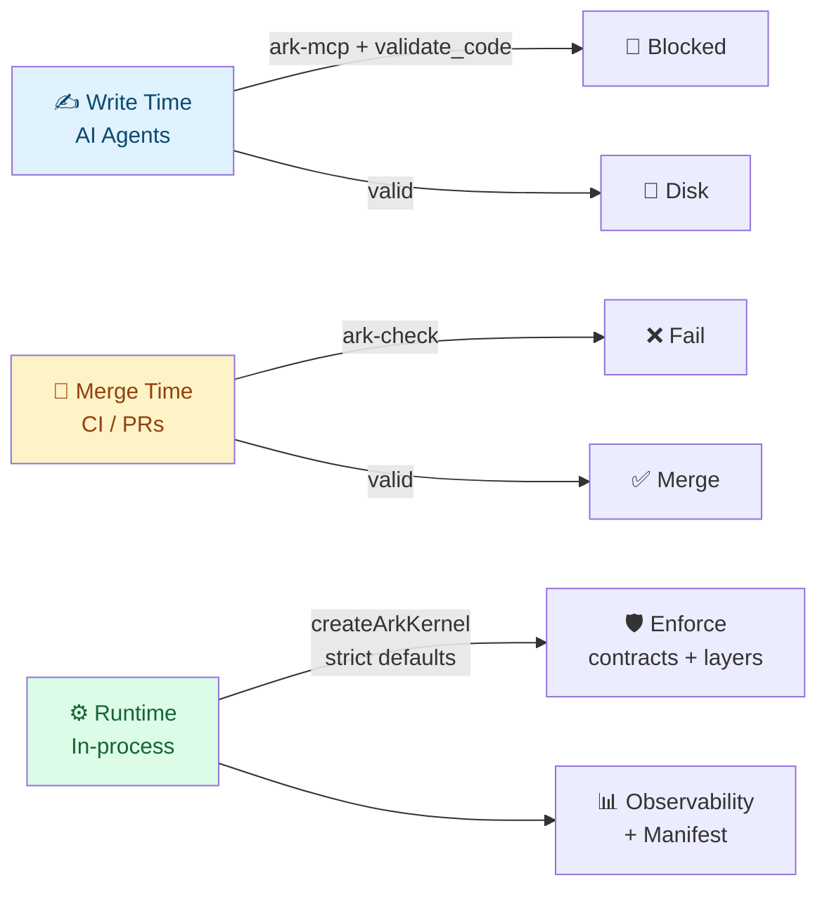

<div align="center">

# 🏛️ Ark — Architectural Runtime Kernel

**Make your architecture a machine-readable, enforceable contract** —<br/>
respected by AI agents at write time, CI at merge time, and the runtime itself.

[](https://github.com/pedroknigge/ark/actions/workflows/ci.yml)
[](https://www.npmjs.com/package/ark-runtime-kernel)
[](LICENSE)


**Zero runtime dependencies** · TypeScript-first · Hexagonal + Event-Driven + DDD governance kernel

[Quick Start](#60-second-setup) · [The Three Gates](#the-three-gates-visual) · [AI Write Gate](#ai-write-path-gate-ark-mcp) · [CI Gate](#ark-check--the-ci-gate) · [Docs](#documentation)

</div>

---

## The Three Gates (Visual)



**One config. Three enforcement moments.**

| Gate         | Tool          | When it runs                  | What it enforces                              |
|--------------|---------------|-------------------------------|-----------------------------------------------|
| **Write**    | `ark-mcp`     | Agent PreToolUse (Write/Edit) | Layer rules, unknown intents, forbidden patterns |
| **Merge**    | `ark-check`   | CI (GitHub Actions etc.)      | Cross-layer imports + intent references (real TS resolver) |
| **Runtime**  | `createArkKernel()` | Running process         | Intent registry, event contracts, observed layer flow, policies |

---

## 60-Second Setup

```bash
npm install -D ark-runtime-kernel typescript
```

### 1. Bootstrap your config from reality

```bash
npx ark-check --init          # detects your folders and writes ark.config.json
```

### 2. Gate CI

```bash
npx ark-check --root . --config ark.config.json --strict-config
```

### 3. Gate AI agents (write path)

```bash
npx ark-mcp --root . --config ark.config.json
```

Bind `--hook` mode to your agent's `PreToolUse` for Write/Edit (see full docs below).

> The same `ark.config.json` powers all three gates.

---

## What Ark Actually Does

Ark turns architecture from **diagrams + good intentions** into **executable contracts**.

### Core Capabilities

- **Intent Registry** — Semantic names (`Domain.Order.OrderPlaced`, `Application.PlaceOrder`) with declared produces/dependsOn relationships.
- **Policy Engine** — Hard policies (throw) + soft policies (observe). Built-in clean-architecture matrix.
- **Strict Event Bus** — Registered intents only, known sources, event contracts, add-only interceptors.
- **Observed Layer Flow** — Runtime enforcement (`'hard' | 'soft' | 'off'`) of *actual* producer → event flows against your layer rules.
- **Event Contracts** — Payload shape validation (including nested + enums).
- **11-Layer Profile** — First-class support for proper Hexagonal/Event-Driven boundaries.
- **Manifest** — `ark.manifest().toJSON()` → complete machine-readable contract for agents and tools.
- **Observability & Drift** — Declared vs observed flow reports.
- **Audit / Outbox / Projections / Workflow (Saga)** — Pluggable in-memory defaults + interfaces.
- **Static + AI Gates** — `ark-check` (deep) + `ark-mcp` + ESLint plugin.

### Enforcement Scope (Be Honest With Yourself)

**Hard at runtime (governed paths only):**
- Unregistered intents / bad names
- Unknown sources
- Contract violations
- Hard policy violations
- Observed layer flow violations (when `hard`)

**CI (with ark-check):**
- Cross-layer imports (real module resolution)
- Intent string references across boundaries
- Raw `publish()` calls
- Missing `source` on strict publishes

**Everything else is out of scope** unless you route it through Ark or cover it with config + CI.

---

## Quick Start — Strict Kernel (Recommended)

```ts
import { createArkKernel } from 'ark-runtime-kernel';

const ark = createArkKernel(); // or createStrictArkKernel()

// 1. Define intents
const OrderPlaced = ark.registry.define<
  'Domain.Order.OrderPlaced',
  { orderId: string; amount: number }
>('Domain.Order.OrderPlaced');

ark.registry.define<'Application.PlaceOrder', { orderId: string }>(
  'Application.PlaceOrder',
  { produces: ['Domain.Order.OrderPlaced'] }
);

// 2. Register contracts (optional but powerful)
ark.eventContracts.register({
  intent: 'Domain.Order.OrderPlaced',
  version: '1',
  allowAdditionalFields: false,
  schema: {
    orderId: { type: 'string', required: true },
    amount: { type: 'number', required: true },
  },
});

// 3. Projections (read models)
ark.projections.register({
  name: 'OrderIds',
  sourceIntents: ['Domain.Order.OrderPlaced'],
  initialState: { ids: [] as string[] },
  project: (event, state) => ({
    ids: [...state.ids, event.payload.orderId as string],
  }),
});

// 4. Publish through source-bound publisher (recommended)
const publisher = ark.publisher('Application.PlaceOrder');

await publisher.publish(OrderPlaced, { orderId: 'o1', amount: 129 }, {
  eventVersion: '1',
  correlationId: 'corr-xyz',
});

console.log(await ark.projections.getState('OrderIds'));
console.log(ark.observability.report());
console.log(JSON.stringify(ark.manifest().toJSON(), null, 2));
```

See `examples/basic/` for a runnable version.

---

## AI Write-Path Gate (`ark-mcp`)

**The killer feature for agentic coding.**

### Pre-write hook (blocks bad code before disk)

In Claude Code (`.claude/settings.json`):

```json
{
  "hooks": {
    "PreToolUse": [{
      "matcher": "Write|Edit|MultiEdit",
      "hooks": [{
        "type": "command",
        "command": "npx ark-mcp --hook --root \"$CLAUDE_PROJECT_DIR\""
      }]
    }]
  }
}
```

When blocked, the agent gets the violations back as feedback and can fix + retry.

### Full MCP server

```bash
npx ark-mcp --root . --config ark.config.json
```

Exposes:
- Resource: `ark://manifest`
- Tool: `validate_code(source, layer?, filePath?)`

Register in `.mcp.json`.

---

## `ark-check` — The CI Gate

```bash
# Basic
npx ark-check --root . --config ark.config.json

# Fail on coverage gaps too
npx ark-check --root . --config ark.config.json --strict-config

# JSON for tools
npx ark-check --json
```

**What it catches (via real TypeScript resolution):**
- Import/export violations (relative, aliases, packages, dynamic import, require)
- String intent references across forbidden layers
- Raw publish calls
- Missing source metadata
- Source-layer mismatch

`--init` generates a real config from the directories that *actually exist* in your project.

---

## ESLint Plugin (dev guardrails)

```js
// eslint.config.js
import ark from 'ark-runtime-kernel/eslint';

export default [
  ark.configs.recommended,
];
```

Rules:
- `ark/no-domain-infra-imports`
- `ark/no-raw-event-publish`
- `ark/require-publish-source`

---

## What Ark Is / Is Not

| ✅ Ark is                              | ❌ Ark is not                              |
|---------------------------------------|-------------------------------------------|
| Runtime + CI + AI governance kernel   | Database or queue                         |
| Enforceable architectural contract    | Full distributed workflow engine          |
| Machine-readable manifest for agents  | Replacement for your domain logic         |
| Zero-dependency TypeScript library    | Complete semantic / type analyzer         |
| Observable drift + history            | OpenTelemetry implementation              |
| Focused, explicit, pluggable          | Magic that covers code you never route    |

---

## Architecture Profile (11 Layers)

The built-in profile + `ark.config.json` give you a sane default taxonomy:

`DomainModel → ApplicationOrchestration → PersistenceAdapters → ...` (and 8 more)

You can customize freely. Rules are deny-by-default except for a few explicitly allowed flows.

---

## Production Notes

All stores (`Audit`, `Outbox`, `Projections`, `Workflow`) default to in-memory.

See [docs/production-hardening.md](./docs/production-hardening.md) for the interface contracts you must implement for durability.

---

## Documentation

- [Agent Integration Guide](docs/agent-guide.md) — wiring `ark-mcp` into Claude Code, Cursor, and other agent runtimes
- [Production Hardening](docs/production-hardening.md) — durable store interfaces to implement (`AuditStore`, `OutboxStore`, …)
- [Example Config](docs/ark-check-example.json) — a hand-curated `ark.config.json` starting point
- [Runnable Examples](examples/) — `examples/basic/` (kernel tour) and `examples/publish-smoke/` (consumer smoke test)
- [Changelog](CHANGELOG.md)

---

## Development

```bash
npm install
npm run typecheck
npm run check:architecture
npm test
npm run build
```

**Release process (already scripted):**

```bash
npm run release:npm          # full verify + publish
npm run release:npm -- --dry # dry run
```

The release script:
1. Typechecks + runs all tests + self architecture check
2. Builds
3. Temporarily swaps in the minimal publish manifest
4. Publishes
5. Restores dev manifest

---

## License

MIT © Pedro Knigge

---

**Ark doesn't generate architecture. It protects the architecture you already have — at the exact moments it matters most.**

Built for teams that use AI heavily and refuse to let entropy win.
