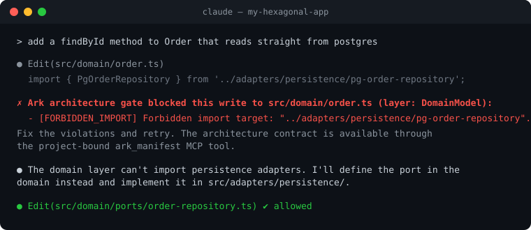

<div align="center">

# ArkGate — Architecture Co-pilot for AI TypeScript

**One architecture config. One check. One coach.**

Your AI writes most of the code. ArkGate keeps that work inside an architecture you can trust —
and makes sure a “green” check means something real.

[](https://www.arkgate.online/)
[](https://github.com/pedroknigge/arkgate/actions/workflows/ci.yml)
[](https://www.npmjs.com/package/arkgate)
[](LICENSE)


</div>

> **ArkGate 4.6.7** is current on npm `latest`.
> A tree is **adopted** only with a required GitHub status running `arkgate-check --strict-merge`,
> or `.ark/adoption-stance.json` `stance: "advisory-only"`. Doctor is compact (`--doctor --all`
> for Details). [4.6.7 notes](docs/releases/4.6.7.md) · [4.6.6](docs/releases/4.6.6.md) ·
> [Docs hub](docs/README.md) · [Product voice](docs/product-voice.md)

---

## Choose your path

| You are… | Go here |
|----------|---------|
| **Anyone** (ship with AI, minimal jargon) | **[Use ArkGate](docs/use.md)** |
| **Developer** (hosts, CI, config, brownfield) | **[Develop with ArkGate](docs/develop.md)** |
| **Contributor** (improve this library) | **[CONTRIBUTING](CONTRIBUTING.md)** |

Full map: **[docs/README.md](docs/README.md)**

---

## Start in one minute

```bash
npm install -D arkgate typescript
npx arkgate start                 # preview files + commands
npx arkgate start --apply         # compact contract + host router + CI plan
npx arkgate-check --doctor        # control plane: status light + primary next action
npx arkgate-check --doctor --all  # encyclopedia (Details)
```

That is the product. Doctor is the control plane — when stuck, do **primary next action #1**.
JSON still carries improvement compass and coach (**not a score**). Compact human output does not.

```text
start → doctor (+ compass) → /ark-adopt (session 0) → day-to-day /ark-place
                         ↘ /ark-explore then /ark-autopilot when leftover design remains
```

Teams: keep the constitution out of product PRs. Local gate
`ark-check --changed --base origin/dev`. Steward law PRs use `--contract-session`.

Aliases `ark` / `ark-check` / `ark-mcp` still work. npm / pnpm / yarn. No install lifecycle scripts.



---

## What it is

A machine-readable architecture file (`ark.config.json`) plus enforcement:

| When | Tool |
|------|------|
| **While the AI writes** | Pre-write block on supported hosts; warning only elsewhere |
| **Before merge** | `arkgate-check` as a **required** CI status |

### Two planes (4.0)

| Plane | What it guards | Config |
|-------|----------------|--------|
| **Layers** (always) | Who may import whom — imports, placement, purity, isolation | `ark.config.json` layers + rules |
| **ArkRules** (opt-in; structure rules inside a layer) | Habits *inside* a layer — structure sensors + domain invariants as data | `arkRules` → `arkrules/<Layer>.json` |

Absence of ArkRules changes no inter-layer verdict. Label residual **`[Layer]`** vs **`[ArkRules]`**.  
Details: [configuration](docs/configuration.md#arkrules-intra-layer-opt-in) · [use path](docs/use.md).

**Not** a web framework, ORM, or job runner. Optional **ArkRun** kernel (`@arkgate/runtime`) is separate and not required for the gate.

**Name note:** npm package `arkgate` — not affiliated with the separate Archgate CLI project.

### When not to adopt

ArkGate is overkill for small trees with **no AI agents** and **no multi-layer boundaries**, for
single-developer hobby CRUDs under no integration pressure, and for teams that will not maintain
`ark.config.json` or a **required** CI status running `arkgate-check --strict-merge`. In those
cases stay with a boundary linter alone (see [Why not only ESLint / Nx / cruiser?](#why-not-only-eslint--nx--cruiser)).
Anyone path: [docs/use.md — When not to adopt](docs/use.md#when-not-to-adopt). Limits of a green
check: [4.3.0 — What ArkGate is / isn't](docs/releases/4.3.0.md#what-arkgate-is--isnt).

---

## Status lights (not settings)

| Light | Means | Your move |
|-------|--------|-----------|
| **Suggest** | Thin / new tree | Finish `start` → doctor |
| **Adapt** | Not fully protected | Doctor action #1 |
| **Enforce** | Honest import edges, and no new UI business-rule files vs merge-base | Keep write path + CI |
| **Enforce · design-weak** | Edges clean; design residual remains | Shape residual — not “done” |

Details: [docs/use.md](docs/use.md).

---

## Host enforcement support

<!-- arkgate-host-support:start -->
| Host | Local write boundary | MCP validation | CI / merge path | Repair payload |
|------|----------------------|----------------|-----------------|----------------|
| Claude Code | **Hard** block for listed ops (PreToolUse `Write` / `Edit` / `MultiEdit`) when installed + trusted | Advisory; the agent must call it | **Required GitHub status context** running `arkgate-check --strict-merge` (alias `ark-check`) | Emitted on hook deny; host must re-inject (hard path when installed + trusted) |
| Grok Build | **Hard** block for listed ops (PreToolUse `write` / `search_replace` (plus aliases)) when installed + trusted | Advisory; the agent must call it | **Required GitHub status context** running `arkgate-check --strict-merge` (alias `ark-check`) | Emitted on hook deny; host must re-inject (hard path when installed + trusted) |
| Google Antigravity | **Hard** block for listed ops (PreToolUse `write_to_file` / `replace_file_content` / `multi_replace_file_content`) when installed + trusted | Advisory; the agent must call it | **Required GitHub status context** running `arkgate-check --strict-merge` (alias `ark-check`) | Emitted on hook deny; host must re-inject (hard path when installed + trusted) |
| Cursor | **Hard** block for listed ops (preToolUse `Write` / `StrReplace`) when installed + trusted | Advisory; the agent must call it | **Required GitHub status context** running `arkgate-check --strict-merge` (alias `ark-check`) | Envelope may emit (`--hook-repair`); reinjection **not** guaranteed |
| OpenAI Codex | **Hard** block for listed ops (PreToolUse `apply_patch` in Codex CLI and local ChatGPT Desktop/App Server) when installed + trusted | Advisory; the agent must call it | **Required GitHub status context** running `arkgate-check --strict-merge` (alias `ark-check`) | Envelope may emit (`--hook-repair`); reinjection **not** guaranteed |
| OpenCode | **Advisory / best-effort** at write (MCP + optional plugin; not a hard boundary) | Advisory; the agent must call it | **Required GitHub status context** running `arkgate-check --strict-merge` (alias `ark-check`) | No hard-boundary payload |

**Read the CI column:** for every host, the repository-wide hard guarantee is a **required**
GitHub **status context** that runs the CLI — not “CI file present,” and not the CLI binary name alone.
Codex hard write covers only a complete local `apply_patch`; Cursor covers only listed
`preToolUse` ops. In both cases the project hook must be installed + trusted, while shell/direct
filesystem writes, hosted or specialized opt-out paths, and human edits still rely on CI.

This table describes the supported profile **after its files are installed and the host loads/trusts them**. A hard local boundary covers only the listed hook operations; alternate tools, direct filesystem writes, and human edits still rely on CI. MCP validation is advisory because the agent must call it. The CI check blocks a merge only when the repository makes that status required. Repair **envelopes** may be emitted without reinjection being guaranteed; silent auto-apply never happens. Run `arkgate-check --doctor` (or `ark-check --doctor`) for the evidence actually detected in the current repository.
<!-- arkgate-host-support:end -->

#### Why the hard guarantee lives at the merge gate

The split above is a deliberate trade-off, not a gap. ArkGate validates at the earliest boundary
each host offers and enforces at the earliest boundary a repository can make non-bypassable: the
required merge status. Hard hooks (Claude Code, Grok Build, Google Antigravity, Cursor, and
Codex’s complete local `apply_patch`) deny their listed write operations at write time; advisory
surfaces (MCP, rules, OpenCode plugins) coach the agent while it works. But any local boundary can
be routed around — another tool, a hosted/specialized path, a direct filesystem write, or a human
edit — so the only guarantee ArkGate claims for every path is the
`arkgate-check --strict-merge` check, and only when the repository makes that status required.
Local checks optimize feedback speed; the merge gate owns correctness.

A useful consequence: the contract doubles as a pressure sensor. Recurring violations or baseline
exceptions concentrated on one layer edge are evidence that the current design stopped fitting the
code — a reason to reshape the contract deliberately (start with `/ark-explore`), never to weaken
the gate.

Setup per host: [docs/ai-gates.md](docs/ai-gates.md) · Develop path: [docs/develop.md](docs/develop.md)

For authoritative MCP contract evidence, call `ark_identity` with the exact project root, then
call `ark_manifest` with that root plus the returned project id. A contained descendant requires
the matching id. The legacy `ark://manifest` resource remains compatibility-only and always
unverified/non-authoritative because standard `resources/read` cannot portably carry that
expectation.

---

## Why not only ESLint / Nx / cruiser?

| | ArkGate | Typical boundary linter |
|--|:---:|:---:|
| CI import rules | ✅ | ✅ |
| Hard-block AI writes on supported hosts | ✅ | ❌ |
| Project-bound contract agents can read (`ark_manifest`) | ✅ | ❌ |
| Placement + preflight for multi-file changes | ✅ | ❌ |
| Honest governed % + dual plan (edges vs shape) | ✅ | ❌ |
| Opt-in intra-layer ArkRules (structure + invariants) | ✅ | ❌ |
| Incomplete analysis cannot look green | ✅ | varies |

---

## Common commands

```bash
npx arkgate start --apply
npx arkgate status --json          # session/project snapshot (identity, activation, last check)
npx arkgate-check --doctor
npx arkgate-check --plan
npx arkgate-check --coverage
npx arkgate-check --strict-merge   # CI / required status
npx arkgate-check --install-agent-gates --tools claude,cursor,codex,grok
# optional: refresh shared home skills (Claude/Grok/Codex; never downgrades)
# npx arkgate-check --install-agent-gates --skills-only --agent-homes --force
# optional: same 13 skills via Agent Skills ecosystem (no new names)
# npx skills add ./node_modules/arkgate/templates/agent-skills
```

More: [docs/develop.md](docs/develop.md) · skills install: [docs/agent-guide.md](docs/agent-guide.md#install-skills-ark-and-ecosystem) · enthusiast track: [docs/enthusiast/](docs/enthusiast/README.md)

---

## Optional ArkRun kernel

Gates need **no** app runtime. The experimental **ArkRun** companion (`@arkgate/runtime`) is separate
and is not a production-readiness claim. `createStrictArkKernel` is the factory: each call creates
an isolated instance (no process-wide singleton). Managed components declare `uses` / `reactsTo` /
`raises` / `sends`; `getDependencyInformationPackage()` is a JSON snapshot and never leaks factories.
`send()` is local / localBlocking / broker (broker falls back to in-process local; `ephemeral`
defaults true; no cloud SDKs in the package). The kernel is not bundled in the `arkgate` tarball.

### Durability stance

Default stores (`InMemoryEventBuffer`, `InMemoryAuditStore`, `InMemoryReadModelStore`,
`InMemoryWorkflowStore`) are **reference in-memory only** — fine for tests and demos; they
**do not** survive restarts and are **not** production durability. Implement the store interfaces
for real systems. Details: [docs/production-hardening.md](docs/production-hardening.md).

---

## Documentation

| Audience | Link |
|----------|------|
| **Docs hub** | [docs/README.md](docs/README.md) |
| Anyone | [docs/use.md](docs/use.md) |
| Developers integrating ArkGate | [docs/develop.md](docs/develop.md) |
| Contributors to this library | [CONTRIBUTING.md](CONTRIBUTING.md) |
| Host install detail | [docs/ai-gates.md](docs/ai-gates.md) |
| Config · package surface · TS | [configuration](docs/configuration.md) · [package-surface](docs/package-surface.md) · [typescript-support](docs/typescript-support.md) |
| Brownfield | [docs/brownfield-adoption.md](docs/brownfield-adoption.md) |
| Security | [SECURITY.md](SECURITY.md) |
| Current published (4.6.7 on npm `latest`) | [docs/releases/4.6.7.md](docs/releases/4.6.7.md) · [CHANGELOG](CHANGELOG.md) |
| Prior published (4.6.6) | [docs/releases/4.6.6.md](docs/releases/4.6.6.md) |
| Prior published (4.6.5) | [docs/releases/4.6.5.md](docs/releases/4.6.5.md) |
| Prior published (4.6.3) | [docs/releases/4.6.3.md](docs/releases/4.6.3.md) |
| Prior (4.6.2) | [docs/releases/4.6.2.md](docs/releases/4.6.2.md) |
| Prior (4.6.1) | [docs/releases/4.6.1.md](docs/releases/4.6.1.md) |
| Prior (4.6.0) | [docs/releases/4.6.0.md](docs/releases/4.6.0.md) |
| Prior (4.5.7) | [docs/releases/4.5.7.md](docs/releases/4.5.7.md) |
| Prior (4.5.0) | [docs/releases/4.5.0.md](docs/releases/4.5.0.md) |
| Prior (4.4.0) | [docs/releases/4.4.0.md](docs/releases/4.4.0.md) |
| Prior (4.3.0) | [docs/releases/4.3.0.md](docs/releases/4.3.0.md) |
| Prior (4.2.1) | [docs/releases/4.2.1.md](docs/releases/4.2.1.md) |
| Previous (4.2.0) | [docs/releases/4.2.0.md](docs/releases/4.2.0.md) |
| Previous (4.1.1) | [docs/releases/4.1.1.md](docs/releases/4.1.1.md) |
| Previous (4.1.0) | [docs/releases/4.1.0.md](docs/releases/4.1.0.md) |
| Previous patch (4.0.1) | [docs/releases/4.0.1.md](docs/releases/4.0.1.md) |
| Previous (4.0.0) | [docs/releases/4.0.0.md](docs/releases/4.0.0.md) |
| Previous (3.9.2) | [docs/releases/3.9.2.md](docs/releases/3.9.2.md) |
| History / maintainer evidence | [docs/archive/](docs/archive/README.md) |

---

## Contribute to this library

```bash
git clone https://github.com/pedroknigge/arkgate
cd arkgate && npm ci && npm run build
npm test && npm run check:architecture
```

Full guide: [CONTRIBUTING.md](CONTRIBUTING.md) · queue: [ROADMAP.md](ROADMAP.md)

---

**Website:** [arkgate.online](https://www.arkgate.online/) · **npm:** [`arkgate`](https://www.npmjs.com/package/arkgate)  
**MCP:** [`io.github.pedroknigge/arkgate`](https://registry.modelcontextprotocol.io/)  
Node ≥ 18 · **MIT**

**Ark doesn’t invent your product. It keeps AI-generated TypeScript inside an architecture you can trust — and tells you when it isn’t really enforcing anything yet.**
