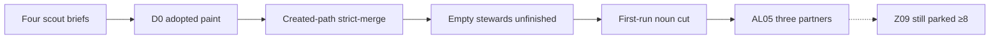

# Plan: Alive in six months

> **Plan (not SSOT implementation docs).** Hub: [AGENTS.md](../../../AGENTS.md) 
> Related: [ROADMAP Phase AL](../../../ROADMAP.md#phase-al--alive-in-six-months) ·
> [enforcement truth at speed](../enforcement-truth-at-speed/README.md) ·
> [team parliament](../team-parliament/README.md) ·
> [field kit](../../field/README.md) ·
> [product voice](../../product-voice.md)

**Status:** In progress — engineering honesty queued; field cohort still not enrolled 
**Slug:** `alive-in-six-months` 
**Kind:** corrective honesty + field (not a feature train) 
**Owners:** product (Pedro) + library maintainers 
**Last updated:** 2026-08-22 
**Code path (existing):** doctor / start / `--strict-merge` / team parliament / first-run copy
(`AL01`–`AL04` implemented in this working tree; `AL05` parked field)

This plan **does not close `Z09` / residual `RB-11`.** The close threshold remains **≥8**
consented adopters with required-status proof plus independent review. `AL05` (three design
partners) is a field start, not that gate. Do not invent adopter counts.

## Problem

Published **arkgate@4.6.5** can look adopted while the merge firewall is missing, new UI
business-rule files stay merge-green, empty `stewards[]` still prints Healthy ENFORCE, and the
first doctor screen teaches a curriculum. A 2026-08-22 premortem (PR #146, **not** on `main`;
path `docs/field/premortem-transcript-20260822.md` on
`origin/cursor/premortem-arkgate-product-e1ac`) named the six-month death: installed theater,
one public false-green, complexity tax, and the coach eating the gate.

Four scout briefs (2026-08-22, scout-only, no product-source patches) pin the holes:

| Scout | Hole |
|-------|------|
| D0 adopted (`/tmp/ark-d0-adopted-scout.md`) | “Adopted” is `AGENTS.md` on disk. ENFORCE is contract-fit. Doctor can print Healthy / “gates can honestly protect you” with CI `present-but-not-required`. `.ark/ci-merge-boundary.json` writer is wired to a field that does not exist, so this tree writes `ci.state: absent` despite fail-closed workflows. |
| Propia created-path (`/tmp/orca-task_78d307e49def-propia-false-green-brief.md`) | Z10’s opt-in `--fail-on-new-smells --base-ref` is `done` (`RB-12`). Advertised `--strict-merge` does **not** evaluate new `domain-logic-in-ui` files. Propia.homes shipped a new UI `can*` helper at exit 0. |
| Stewards or Adapt (`/tmp/ark-stewards-or-adapt-brief.md`) | Empty `stewards[]` never runs the team preflight on `--strict-merge`. T4/T5 (`--policy-ack` weaken, `--update-baseline`) do not require `--contract-session`. Doctor can still print `✔ Healthy — nothing to do`. |
| First-run noun (`/tmp/ark-first-run-noun-scout.md`) | Start help 14 nouns, preview 16, doctor first 80 lines **52**. Compass + coach + Shape/plan-B curriculum occupy the first screen. Budget is **≤12** product nouns. |

These are not reasons to reopen CX03, retcon Z10 to `todo`, or spend the `doing` slot on
explore / compass / skill-body deepen. They are honesty residuals against already-shipped
invariants.

## Outcome

A tree is **D0 adopted** only when a **required GitHub status** runs
`arkgate-check --strict-merge` **or** an explicit `.ark/adoption-stance.json` records
`stance: "advisory-only"`. Without that, doctor / start / status must not sound like success.
`operatingMode: enforce` stays **contract-fit** (coverage + clean checked imports). Do **not**
flip `ok`, `goal.met`, or `valid` for stance.

Default `--strict-merge` fails **new** UI `domain-logic-in-ui` files versus merge-base when a
base exists; historical residual and worsened-in-existing-file stay green; missing base skips
(no exit 2). Full new+worsened remains `--fail-on-new-smells` (Z10 unchanged).

Empty `stewards[]` cannot print Healthy ENFORCE. T4/T5 require `--contract-session` even with
an empty list. JSON `operatingMode` stays `enforce` (unfinished residual, not Adapt).

First human `ark start --help`, `ark start` preview, and doctor first screen each use **≤12**
product nouns. Compass and coach human sections hide; JSON stays. No new skill names.

Field: Pedro enrolls **3** design partners with required-status proof (`AL05`, parked). That
does **not** close Z09.

## Users & success

- **Primary users:** TypeScript teams installing ArkGate after 4.6.5; maintainers reading
  doctor/start as truth; Pedro as the only person who can enroll partners.
- **Success metrics:**
  - doctor never prints `✔ Healthy — nothing to do` or “gates can honestly protect you”
    unless adopted (`required-merge` or `advisory-only-acked`);
  - `classifyAdopted` is `not-adopted` when the workflow exists but the status is not
    required and no explicit `advisory-only` ack exists;
  - a Propia-shaped **new** UI `can*` / policy file fails bare `--strict-merge`; an unrelated
    edit beside historical `legacy-policy.ts` stays green;
  - empty `stewards[]` + ENFORCE is unfinished; weaken/grow without `--contract-session`
    exits 1;
  - start help / preview / doctor first screen each ≤12 product nouns; compass/coach JSON
    still present;
  - **0 invented adopter counts**; AL05 records three consented partners with required-status
    proof or stays parked; Z09 still needs ≥8.
- **Non-goals / out of scope:** closing Z09 / RB-11; reopening Z10; flipping ENFORCE to
  Adapt for empty stewards; new skill names; scores; LLM verdict; org IAM; auto-writing
  `.ark/adoption-stance.json` from `ark start`; querying GitHub by default in a way that
  fail-closes to “proven not required.”

## MVP scope

| Slice | In scope | Later / out |
|-------|----------|-------------|
| `AL01` | D0 adopted: required `--strict-merge` status **or** explicit `advisory-only` stance; doctor/start/status success paint; **fix `ci-merge-boundary` writer wiring** | Live GitHub API as default doctor; Z09 cohort math |
| `AL02` | Created-path `domain-logic-in-ui` on `--strict-merge` / `--strict` / Action via existing `--strict`; skip missing base | Full new+worsened (that is Z10 `--fail-on-new-smells`); global smell inventory as merge gate |
| `AL03` | Stewards or Adapt (TW09-shaped): empty list cannot print Healthy ENFORCE; T4/T5 need `--contract-session` even with `stewards: []` | Org IAM; flipping `operatingMode` to `adapt`; PreToolUse harden for humans |
| `AL04` | First-run noun cut ≤12 on start help/preview and doctor first screen; hide compass/coach **human** sections | New skill names; compass/coach deepen; compact-router reshape |
| `AL05` | Field: enroll **3** design partners with required-status proof (Pedro) | **Z09 close** (≥8 + D30/D90 + independent review). Do not invent counts |

## Acceptance criteria

- [ ] **A1 — D0 adopted (`AL01`):** adopted iff required GitHub status running
  `arkgate-check --strict-merge` **or** `.ark/adoption-stance.json` with explicit
  `stance: "advisory-only"` (wrong/empty `stance` is not an ack). Doctor human must not
  contain `✔ Healthy — nothing to do` or green “gates can honestly protect” without that.
  `productHonesty.finished` is false until required or ack. Next action #1 is require the
  status or write the ack when not adopted. **`operatingMode` may remain `enforce`.**
  Envelope `ok` stays analysis completeness. `goal.met` / `--strict-merge` `valid` stay
  architecture verdicts. Fix `runDoctor` so `writeCiMergeBoundary` receives
  `adoption.enforcement?.github` (or mapped `ciMerge.required`), not
  `deployPath.github`. Producer gap-empty is not Adoption complete.
- [ ] **A2 — Propia created-path (`AL02`):** bare `--strict-merge` on a new UI
  `domain-logic-in-ui` file vs resolvable merge-base: exit 1, `valid: false`. Historical
  residual, path-only moves, presentation-only names, and worsened predicates in an
  **existing** file stay green. Missing base: skip delta, **do not** exit 2. Z10
  `--fail-on-new-smells --base-ref` tests still pass. **Do not retcon Z10 to `todo`.**
- [x] **A3 — Stewards or Adapt (`AL03`):** empty `stewards[]` cannot print Healthy ENFORCE
  (steward residual → next action; `empty-stewards` honesty reason; `finished: false`).
  T4 weakening and T5 `--update-baseline` require `--contract-session` even with an empty
  list; `--policy-ack` remains the hash tooth. `operatingMode` stays `enforce`. No IAM.
  No 14th skill.
- [x] **A4 — First-run noun cut (`AL04`):** `ark start --help`, `ark start` preview, and
  the first doctor screen each expose **≤12** product nouns. Hide improvement-compass and
  deep-module-coach **human** sections; JSON `improvementCompass` / `deepModuleCoach`
  unchanged. No new skill names (13 frozen). No scores. No JSON/roadmap ids on the first
  human screen.
- [ ] **A5 — Field start (`AL05`, parked):** three consented design partners with
  **required-status proof**, recorded only when real. Does **not** close Z09. ≥8 remains
  the close threshold. Missing/unrecorded = not enrolled.
- [x] **A6 — Hard lines held at authoring:** CX03 marked `done` (4.6.5 from #145). Z09 /
  RB-11 stay parked/open. Z10 stays `done`. PR #146 premortem is **not** merged by this
  plan. This authoring slice edits docs + ROADMAP only.

## Proposed public surface (hypothesis)

| Kind | Surface | Notes |
|------|---------|-------|
| Local honesty file | `.ark/adoption-stance.json` | Explicit `stance: "advisory-only"` only; do not auto-write from `ark start`; prefer Tooling, not a Domain fs read |
| Doctor JSON | Additive `doctor.adoptionStance` (optional) | Do not change envelope `ok` or `schemaVersion: "1.0"` required keys |
| CI merge boundary | Existing `.ark/ci-merge-boundary.json` | Fix writer; optional additive `adopted`; keep `present-but-not-required` / Free-cannot-require |
| Design delta | Optional `enforcementScope: 'created-paths' \| 'touched-new-or-worsened'` | Additive on schema 1.0; `--strict-merge` uses created-paths; full ratchet stays opt-in |
| Human CLI | Start help/preview + doctor first screen | ≤12 nouns; compass/coach collapsed, not deleted from JSON |
| Skills | Same 13 names | Hide jargon; do not add `/ark-compass` or `/ark-coach` |

## Approach

1. Queue this plan and mark `AL01` `doing` (this authoring slice).
2. Fail tests first for D0: Healthy without stance/required; ci-merge-boundary wiring;
   `stay-enforced` without adopted facts.
3. Classify adopted in Tooling; fix the boundary writer; gate **paint** not `operatingMode`.
4. Fold created-path evaluation into `--strict-merge` with skip-on-missing-base.
5. Session tooth on loosen/grow even when `stewards` is empty; doctor unfinished, not Adapt.
6. Cut first-run nouns; hide compass/coach human sections.
7. Pedro enrolls three partners with required-status proof when real — never to close Z09.

**Implementation order once `AL01` is `doing` in code:** failing tests → `classifyAdopted` +
ci-merge-boundary wiring → productHonesty + Healthy + doctor #1 → status nextAction → start
wrap-up copy → HTML blurb.

## Dependencies & risks

- **Depends on:** arkgate@4.6.5 published (`CX03` / PR #145); Z10 `done` (do not un-earn);
  TW01–TW08 `done` (AL03 is TW09-shaped follow-up); parked Z09 remains the claim gate.
- **Blocked by:** nothing for AL01–AL04 engineering. `AL05` is blocked on Pedro’s real
  enrollments. Z09 stays parked until signed matrix + ≥8 + reviewer identity.
- **Risk — overloading ENFORCE as adopted.** Kill switch: keep `operatingMode: enforce` as
  contract-fit; gate Healthy / `finished` / start wrap-up / `stay-enforced` only.
- **Risk — brownfield cliff on `--strict-merge`.** Kill switch: created **new** UI smell
  files only; never fail historical residual or worsened-in-existing-file; missing base
  skips (EH04), does not exit 2.
- **Risk — flipping Adapt for empty stewards.** Kill switch: unfinished residual + session
  tooth; do not retcon `resolveOperatingMode`.
- **Risk — coach deepen during the freeze.** Kill switch: 30 days from 2026-08-22, ROADMAP
  `doing` must not be explore / compass / skill-body deepen. AL04 may **hide** those
  sections; it may not add lenses, candidates, or skill names.
- **Risk — invented field counts.** Kill switch: AL05 and Z09 stay empty until real
  required-status proof; this repository must not invent N.
- **Risk — release cadence theater.** Kill switch: ≤1 npm `latest` per 14 days; ban three
  `latest` tags in 36 hours (4.6.3 / 4.6.4 / 4.6.5 pattern).

## Freeze (30 days from 2026-08-22)

- No explore / compass / skill-body deepen as ROADMAP `doing`.
- AL04 hide/collapse of existing compass/coach strings is allowed; new lenses/candidates
  / skill names are not.
- Cadence: **≤1** npm `latest` / **14 days**. Ban **three** `latest` tags in **36 hours**.
- 13 skill names stay. No scores. No LLM package verdict. Compass/coach stay `notAScore`
  and never flip `valid` / strict-merge / `goal.met`.

## Resolved decisions

1. Adopted is **required `--strict-merge` status or explicit advisory-only ack**, not
   `AGENTS.md`, not a workflow file, not ENFORCE light.
2. Do not flip `ok` / `goal.met` / `valid` for stance or empty stewards.
3. Z10 stays `done`; AL02 is default-merge consumption of created-path delta, not un-earning
   the opt-in ratchet.
4. Empty stewards follow **design-weak unfinished**, not a new operating mode.
5. First-run cut is progressive disclosure of existing surfaces, not a new skill namespace.
6. This plan does not close Z09. AL05’s 3 ≠ Z09’s ≥8.

## Open decisions

1. Whether status grows an optional `adoptionStance` field (schema 1.0 additive) or Tooling
   passes `nextActionOverride` only (`AL01` implementer chooses the smaller compatible path).
2. Whether `teamCheckRequested` flips all `--strict-merge` on with empty stewards (TW02 prose)
   or T4 session-on-weakening plus `evaluateTeamGate` is enough (`AL03` must call the choice
   out in the implementation PR).
3. `Z09` independent-review identity (unchanged; not AL).

## Relationship to retained work

- Phase CX (`CX03`) is `done` in 4.6.5. Do not reopen its ship scope.
- Phase Z engineering (Z01–Z08, Z10) stays `done`. Z09 stays **parked** claim gate.
- Phase TW (TW01–TW08) stays shipped; AL03 is the TW09-shaped honesty follow-up, queued here
  so the library has one `doing` train.
- IC / DC coach and compass stay shipped; AL04 hides first-run human sections only.
- Premortem PR #146 is field evidence, not a merge of this phase.

## Corrective release policy

- AL01–AL04 are honesty / fail-closed tightening of advertised merge and doctor paint.
  Ship as **Changed** on the next patch/minor the queue already owns — not a major, not a
  config migration, not auto-ack of advisory-only.
- Do not wait for AL05 or Z09 to land AL01–AL04.
- Do not publish three `latest` tags in 36 hours.
- Repository truth warnings may merge immediately; npm `latest` follows the cadence freeze.

## Promotion

The implementation IDs are tracked in [ROADMAP Phase AL](../../../ROADMAP.md#phase-al--alive-in-six-months).

1. One `doing` at a time. Current: **`AL01`**.
2. Keep `Z09` **parked**. AL05 does not promote it.
3. Do not retcon Z10 to `todo`. Do not mark CX03 `doing`.
4. When AL01–AL04 are `done`, this plan stays **In progress** until AL05 has three real
   required-status partners **or** the owner parks the field slice explicitly — still without
   closing Z09.
5. When Z09 later closes residual `RB-11`, that evidence lives under Phase Z / `docs/field/`,
   not as an AL success metric.

## Related

- Canonical queue and hard lines: [ROADMAP.md](../../../ROADMAP.md)
- Scout briefs (authoring inputs, 2026-08-22): D0 adopted, Propia created-path, Stewards or
  Adapt, first-run noun cut
- Prior false-green / completeness: [enforcement-truth-at-speed](../enforcement-truth-at-speed/README.md)
- Parliament shipped surface: [team-parliament](../team-parliament/README.md)
- Field scaffolding: [docs/field/README.md](../../field/README.md)
