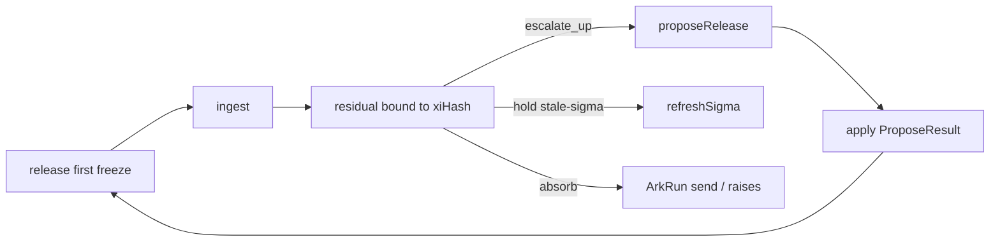

# ArkOrder valved loop — principle control, then travel

> **Plan, not implementation authority.** Code and executable schemas decide whether a
> claim is true. Work starts only when item IDs appear as `doing`/`todo` in
> [ROADMAP.md](../../../ROADMAP.md). Hub: [AGENTS.md](../../../AGENTS.md) ·
> [ArkOrder](../arkorder/README.md) · [ArkOrder × ArkRun](../arkorder-arkrun/README.md) ·
> [ADR index](../../adr/README.md) · canonical surface [arkorder.md](../../arkorder.md)

**Status:** In progress (`LV01`–`LV02` done; `LV03`–`LV09` `todo`; engineering `doing`: none).<br>
**Slug:** `arkorder-valve-loop`<br>
**Kind:** epic / Haken control loop on the existing extras<br>
**Prefix:** `LV` (valved loop)<br>
**Owners:** product (Pedro) + library maintainers<br>
**Last updated:** 2026-08-31<br>
**Target package:** additive **`arkgate@4.9.0`** when `apply` / `refreshSigma` / ingest
residual ship on `arkgate/order` (public verbs). No `ark.config` schema bump unless a
later item proves a new config key. In-memory default unchanged.<br>
**Code path (when doing):** `src/domain/arkOrder*.ts`, `src/kernel/order/`,
`src/domain/arkRunInformationPackage.ts` / compare (LV06–LV07), gallery
`examples/arkorder-billing/`

Does **not** close `Z09` / residual `RB-11` or `K01`. Does **not** merge the planes.
Does **not** copy Orderfield’s CLI, phases, packets, or worktrees.
Does **not** add a `/ark-order` skill. Does **not** turn `arkOrder` on in this
library’s 4-layer `ark.config.json`.

---

## 0. The finding that comes before any feature

ArkOrder 4.8.5 is a **skip firewall plus a kind-gate**. Four verbs exist.
`proposeRelease` returns blast. `ingest` returns `absorb | escalate`. Sensors
stop a Prisma PATCH of `xiKeys`. That is enough for “the agent must not rewrite
the plan.”

It is **not** enough for Haken as control:

| Orderfield (agent waves) already | ArkOrder (product pattern) today |
|---|---|
| Slaves never write `ORDER.json` | Anyone with the plane can call `release()` again |
| Residual bound to ORDER rev + packet identity | `reason: string`; no bind to `Release.hash` |
| Closed regime menu after integrate | `target: human \| scale \| hold` with no apply |
| Disk is the session | `current()` dies with the process |
| Packet is \(s \approx f(u)\) | Projector is an `allowedKinds` allowlist; **payload ignored** |
| SPEC is truth; contrast vs original | No tape of “why this event escalated” |

XP shipped shadow/replay on the **component** information package
([ADR 0033](../../adr/0033-arkorder-runtime-half-is-arkrun.md)). That tape
does not know a `Release`. Absorb does not `send()`. Escalate does not
`raises`. σ is hashed into the same `Release.hash` as ξ, so refreshing
saldo looks like a new pattern.

The lesson from Orderfield is the **valved loop**, not the harness:

1. ξ is written by one role, through a closed menu.
2. s leaves a residual bound to the current ξ identity.
3. Integrate chooses a regime; nobody invents one.
4. The original (SPEC / catalog release) is not compressed.
5. Session is a port (disk there, `ReleaseStore` here) — chat/RAM is not the field.

Copy that loop. Do not copy `of pack` / `explore|cut|build` / `SLAVE.md`.

---

## 1. What this epic owns

```text
LV01–LV05   ArkOrder   valve, σ identity, residual, capacity-as-data
LV06–LV07   ArkRun     decision tape + thin intent bridge (ADR 0033)
LV08        ArkOrder   ReleaseStore port (in-memory default; not K01)
LV09        both       docs / skills deepen / gallery uses the loop
```

Public sentence after LV09 (README, use, arkorder.md):

> ArkOrder freezes the pattern through a valve. ArkRun is how the residual travels.

v0 physics stays the billing fixture. Construction / Amarilla-shaped catalogs
rename keys and inject a store; they do not grow 500 SKUs into ξ
(`ARKORDER_NESTED_XI` stays). Product statuses (`Requested → Delivered`) stay
on the consumer aggregate. They are **not** plane states.



---

## 2. Locked decisions (LV01 produces the ADR)

Authority will be the accepted ADR (`0034` reserved). This section is the
index the ADR must lock — not a second rationale.

| D | Decision |
|---|----------|
| D1 | After the **first** `release(ξ)`, a later `release()` whose ξ differs from `current.xi` fails closed (`ARKORDER_UNVALVED_RELEASE`). Pattern change is `proposeRelease` then **`apply(ProposeResult)`**. Empty blast still fails. First freeze remains `release()`. |
| D2 | ξ identity and σ identity are **not** the same hash. Additive `xiHash` (and σ stamp) so saldo / clocks can `refreshSigma` without minting a pattern. Combined `hash` compatibility is an ADR detail — do not silently retcon persisted hashes. |
| D3 | Stale σ does **not** mint a Release. `ingest` returns residual `hold` (reason `stale-sigma`). `ARKORDER_XI_TTL` stays: freshness never lives on ξ. |
| D4 | Ingest residual is closed: `absorb \| escalate_up \| hold`, bound to `xiHash` + event identity. Closed `reasonCode` (`not-in-pattern`, `stale-sigma`, `pack`, `capacity`). Optional `proposed_patch` (nextXi candidate) only on `escalate_up`. String `reason` may remain as human text; it is not the regime. |
| D5 | Capacity is **data** on `ConstraintPack` (`kind`, `sigmaKey`, `payloadKey`, `op: 'lte' \| 'lt' \| 'gte' \| 'gt'`). No user predicates (ADR 0016). Over-cap is residual, not a new kind invented by the caller. |
| D6 | Decision tape lives on **ArkRun** information package (refine ADR 0033). Records `{ xiHash, event, residual }`. `shadow` / `compare` / `replay` that tape. Not a second bus, not Postgres. |
| D7 | Thin bridge only: `FieldEvent.kind` may ride an ArkRun intent; absorb may `send()`; `escalate_up` with `target: human` may `raises`. Consumer still owns handlers. No coordinator on every request. |
| D8 | `ReleaseStore` is an **injected port**, in-memory default. Optional catalog **digest** keyed by a ξ id (e.g. `catalogReleaseId`) may enter the hash — the SKU set does not. This does **not** close `K01` (no durable outbox, no shipped Postgres). |
| D9 | No new skill names. Adopt / place / autopilot deepen. Compact starters stay extras-off. Absence of `arkOrder` stays silent. |

---

## 3. Queue

Live statuses live in [ROADMAP.md](../../../ROADMAP.md). Seed:

| ID | Depends | Size | Outcome |
|----|---------|------|---------|
| `LV01` | XP08 | M | ADR **0034** accepted: D1–D9. Plan lock only — no plane code. |
| `LV02` | LV01 | L | `apply(ProposeResult)` on `createOrderPlane`. Unvalved second freeze fails closed. Diagnostic catalog + skip corpus. First `release()` unchanged. |
| `LV03` | LV01 | L | `xiHash` vs σ; `refreshSigma`; stale σ → residual `hold`. Additive hash fields. Tests that saldo refresh does not change `xiHash`. |
| `LV04` | LV02+LV03 | L | Ingest residual type + bind + closed `reasonCode`. `IngestEscalate.target` remains. Billing tests: allowed kind absorbs; unknown kind `escalate_up`. |
| `LV05` | LV04 | M | Capacity pack as data. Billing: `SeatAdded` vs `σ.seatCap`. Over cap → residual (not a pre-classified kind). No predicates. |
| `LV06` | LV04 | L | Decision tape on ArkRun information package; shadow/replay/compare the tape. Component snapshot API unchanged. |
| `LV07` | LV06 | M | Thin bridge in gallery (+ types/helpers if needed): absorb → `send`; escalate_up human → `raises`. No new skill. |
| `LV08` | LV02+LV03 | M | `ReleaseStore` port, in-memory default. Optional catalog digest keyed by ξ id. Durability honesty: not K01. |
| `LV09` | LV05+LV07+LV08 | M | `docs/arkorder.md` loop section; skills deepen; doctor/status remain `notAScore`; billing example uses valve + residual + tape. Publish **4.9.0**. No `/ark-order`. |

One `doing` at a time. Do not start an ID until its dependencies are `done`.

Suggested serial order: `LV01 → LV02 → LV03 → LV04 → LV05 → LV06 → LV07 → LV08 → LV09`.
`LV03` may start after `LV01` (no code dependency on `apply`) but ROADMAP stays
serial unless engineering splits with an explicit note. `LV08` may follow
`LV03` once hashes exist; it must not land before the valve (`LV02`).

---

## 4. Placement in this tree

| Layer | Path |
|-------|------|
| DomainModel | residual / hash / capacity-pack types + pure invariants (`generate:cli-pure`) |
| Kernel | `src/kernel/order/` (`apply`, `refreshSigma`, store port) · ArkRun tape on `arkgate/runtime` |
| Tooling | diagnostic catalog, skip corpus, ESLint envelope only if a closed lexical fact exists |
| FrameworkAdapters | **empty** — no Nest Order adapter |

Root `import from 'arkgate'` still must not grow `createOrderPlane`.
Lexical unvalved-release is optional; **runtime fail-closed is the authority**.
Do not invent a sensor that infers “this looks like a second freeze.”

---

## 5. What we will not build

Carried forward from [arkorder-arkrun](../arkorder-arkrun/README.md) §5, plus:

- Orderfield CLI, phases (`explore\|cut\|build\|…`), packets, residuals-on-disk as
  `.orderfield/`, adapters, worktrees, `SLAVE.md`, pulse-watch
- Purchase-request workflow states on the plane (`Requested` / `Approved` / `Delivered`)
- KPI keys in ξ (`Spend In Contract %`, “reactive → 0”)
- User predicates / LLM “this SKU belongs in the catalog”
- A second event bus, outbox, or hosted plane (degraded-mode stays rejected)
- `getPlane()` process singleton
- Schema `1.4` “because we can” — only if a **config** key is proven necessary
- Closing `K01` by calling the in-memory store durable

> If a “slow parameter” changes with every click, payment, or recipient, it is
> not an order parameter — it is centralised operational state wearing the name.

---

## 6. Kill switches

- Companion grows a bus, inspector HTTP, Nest adapter, or `getPlane()` → stop.
- Extra flips `valid` when absent or advisory → bug, not a feature.
- `apply` bypassed by a public `release()` that changes ξ → revert LV02.
- `refreshSigma` changes `xiHash` → revert LV03.
- Capacity pack accepts a function → violates ADR 0016; revert LV05.
- Decision tape requires a broker or disk to `compare` → violates ADR 0033; revert LV06.
- New skill name `/ark-order` → forbidden (ADR 0015).
- This mother `ark.config.json` turns `arkOrder` on against Layers → out of scope.
- README claims Order replaces Run, or that the plane is Postgres → revert voice.

---

## 7. Success

A stranger copies `examples/arkorder-billing/`, renames the three keys, and:

1. First `release` freezes ξ.
2. `ingest` of an allowed kind **absorbs** and the residual names `xiHash`.
3. Over-cap (capacity pack) **holds / escalates** without a homemade kind.
4. Changing `plan` requires `proposeRelease` then `apply`; a raw second `release`
   of a different ξ does not land.
5. `refreshSigma` (grace / seatCap) does not look like a new pattern.
6. ArkRun tape replays “why this event did not absorb” in-process.
7. They may inject a `ReleaseStore`; the default is still in-memory and **not**
   durable. `K01` remains parked.

Construction / field-purchase catalogs do the same with
`catalogReleaseId` + digest — no kernel change, no 500 keys in ξ.

---

## 8. Adjacent, not this epic

- **`K01`** — durable stores, bus commit, atomic outbox. Parked. LV08 is a port
  with an in-memory default, not that residual.
- **`Z09` / `RB-11`** — retained-adoption / independent close. Unchanged.
- **ArkRules configuration invariants** — pinned file values. Still the ArkRules
  line ([arkorder-arkrun](../arkorder-arkrun/README.md) §6).
- **Orderfield** remains the agent-wave kernel (disk-backed). This epic does not
  vend `of`, and `of` does not vend `arkgate/order`.
