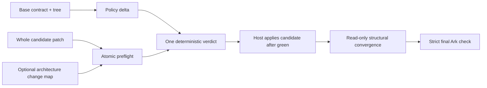

# Plan: Change integrity loop

> **Plan (not SSOT implementation docs).** Library hub: [AGENTS.md](../../../AGENTS.md) 
> Related: [ROADMAP.md](../../../ROADMAP.md) · [configuration.md](../../configuration.md) · [package-surface.md](../../package-surface.md) · [agent-guide.md](../../agent-guide.md) · [threat-model.md](../../threat-model.md) 
> `ROADMAP.md` owns order and status. This plan owns the bounded product rationale and acceptance for Phase T.

**Status:** In progress (`T03`) 
**Slug:** `change-integrity-loop` 
**Kind:** epic 
**Owners:** product (Pedro) + library maintainers 
**Last updated:** 2026-07-14 
**Code path:** `src/domain/policyDelta.ts`, `src/domain/changeMap.ts`, `src/kernel/analysis.ts`, `bin/lib/policy-delta-io.mjs`, `bin/lib/prepare-change.mjs`, and existing CLI/MCP/Action adapters

---

## Problem

ArkGate validates the current repository and can prepare one source write, but a real agent change
is often a transaction: it may alter `ark.config.json`, create and edit several files, delete an
old path, and introduce edges that exist only when the whole patch is considered.

Three gaps remain:

1. **The transition can be unsafe even when the destination parses.** A change can make the gate
   green by shrinking `include`, expanding exclusions or allowlists, removing a deny rule,
   disabling peer isolation, or relaxing a safety threshold. Present-state diagnostics do not
   explain what became weaker.
2. **Single-file preparation is not atomic patch preparation.** Files that look acceptable alone
   can form a forbidden edge or cycle together. The Kernel already has an in-memory change-set
   primitive, but hosts cannot use it through a parity CLI/MCP surface.
3. **Gate-green is not the same as change-complete.** For multi-step work, ArkGate cannot compare
   an agreed architectural change map with the actual paths and edges. Agents discover omissions
   and scope drift late and by judgment alone.

The product opportunity is to close those deterministic gaps without becoming a requirements
manager, task tracker, workflow engine, or general codemod.

## Outcome

Before a multi-file write, an agent can ask ArkGate whether the proposed contract and complete
patch preserve or strengthen the architecture. After implementation, it can run a read-only
structural convergence check against an optional change map. The ordinary `ark-check` remains the
final authority, and repositories that never create a change map behave exactly as they do today.

The result must survive context loss. `AGENTS.md`, skills, and session context may teach the agent,
but the pass/fail decision depends only on the versioned contract, explicit compiler inputs, the
base tree, and the candidate change.

## Product invariants

1. **Contract over context:** `ark.config.json` plus the deterministic engine is authoritative;
   prompt memory and model judgment never decide enforcement.
2. **Earliest honest boundary:** use a hard PreToolUse gate where the host exposes a covered write
   event, transactional MCP preparation where invoked, and CI as the final repository boundary.
   MCP registration alone remains advisory.
3. **One verdict:** identical base, candidate, compiler inputs, and policy produce equivalent
   verdicts, hashes, and evidence through Kernel, CLI, MCP, hook, and CI adapters.
4. **Dual-depth response:** every denial gives a casual user one concrete next action and gives an
   experienced engineer stable rule ids, locations, hashes, and machine-readable evidence.
5. **Positive correction:** ArkGate should identify a valid governed destination or smallest safe
   correction when deterministically knowable, rather than only saying that a boundary was crossed.

## Users & success

### Primary users

| User | Job to be done |
|------|----------------|
| Agent using MCP or a write hook | Validate one complete candidate patch before any file is committed |
| Maintainer reviewing a contract edit | See exactly which protections became stronger, neutral, ambiguous, or weaker |
| Team executing a multi-step change | Detect missing or unplanned architectural work without claiming functional completion |

### Success metrics

| Metric | Required direction |
|--------|--------------------|
| Architecture-invalid writes in the fixed multi-file scenario | Down versus single-file/write-first flow |
| Placement/rework turns before a green final check | Down or equal, never worse without an explained tradeoff |
| Seeded contract weakenings detected before merge | All supported mutation classes detected |
| Batch-preflight verdict parity with final `ark-check` | Exact on the acceptance corpus |
| Existing no-change-map workflows | No behavioral or setup regression |
| Verdicts that depend on `AGENTS.md`, skill prose, or live-model interpretation | Zero |
| Advisory-only host profiles reported as hard enforcement | Zero |
| Default setup footprint after Phase T | No new required artifact; retain the existing compact-install budget |
| Denials without stable evidence and a concrete next action | Zero on the acceptance corpus |

### Non-goals / out of scope

- Generating product specs, user stories, acceptance criteria, tasks, issues, or branches.
- Parsing free-form requirements and claiming they are implemented.
- A second constitution beside `ark.config.json`.
- New `/ark-*` skill names, presets, policy packs, extension catalogs, or role bundles.
- Workflow DAGs, resumable orchestration, arbitrary command execution, or an agent scheduler.
- Silent contract weakening, silent judgment auto-apply, or a general codemod.
- Treating file/path traceability as proof of functional correctness.
- Treating `AGENTS.md`, rules files, session injection, or an optional MCP call as a security
  boundary.

## MVP scope

| In MVP | Later / out |
|--------|-------------|
| Semantic delta for the supported `ark.config.json` contract | Organization-wide policy inheritance or control plane |
| Explicit acknowledgment bound to old/new policy hashes | Permanent allowlists of blanket weakening approvals |
| Atomic create/update/delete source preflight | Judgment-heavy multi-file auto-apply |
| Optional versioned architecture change map | Mandatory committed planning files |
| Read-only structural convergence against the actual change | Natural-language semantic completion analysis |
| Existing CLI/MCP/current-skill integration | New skill namespace or full workflow product |
| Adversarial fixtures plus fixed acceptance tests in eval | Broad public-repo campaign before the MVP proves value |

## Acceptance criteria

- [x] **A1 — Contract transition honesty:** Supported contract changes are classified as
      `strengthening`, `neutral`, `judgment-required`, or `weakening`; invalid or unknown deltas
      fail closed.
- [x] **A2 — Hash-bound exception:** Strict merge rejects an unacknowledged weakening. An explicit
      exception names the finding and binds to both old and new policy hashes, so later edits
      invalidate it.
- [x] **A3 — Atomic patch verdict:** A single operation accepts creates, updates, and deletes,
      catches cross-file forbidden edges and cycles, and matches the final full-check verdict on
      the acceptance corpus.
- [x] **A4 — No partial commit:** Preflight is read-only and returns per-file evidence plus policy
      and content hashes. ArkGate never writes a subset of a rejected patch.
- [x] **A5 — Optional change map:** A strict, versioned JSON document can declare planned file
      operations and local dependency edges without embedding product requirements or becoming a
      default setup file.
- [ ] **A6 — Honest convergence:** The final report distinguishes satisfied structural work,
      planned-but-missing work, contradictions, and unplanned architectural impact. It never says
      the feature is behaviorally complete.
- [ ] **A7 — Adapter parity:** CLI, MCP, hooks where the host exposes a complete patch, and CI use
      the same engine and compatible machine-readable verdicts. Unsupported hosts remain reported
      honestly.
- [ ] **A8 — Evidence before release:** Mutation/property fixtures cover policy deltas; batch
      fixtures cover create/update/delete and cycles; a fixed feature scenario finishes with its
      prewritten acceptance tests and strict Ark check green.
- [ ] **A9 — Context-independent verdict:** Removing generated `AGENTS.md`, skills, and injected
      session context does not change the verdict for the same explicit contract and candidate.
      No enforcement path calls an LLM.
- [ ] **A10 — Honest enforcement ladder:** Doctor and machine output distinguish supported,
      installed, active, and bypassable enforcement. Hard is reported only for a trusted hook path
      that covers the attempted operation; MCP-only remains advisory; CI evidence is explicit.
- [ ] **A11 — Actionable denial:** Every blocking finding includes stable rule/evidence fields and
      one deterministic human next action. When a valid governed destination or mechanical-safe
      correction is knowable, the same answer is available in human and JSON output.
- [ ] **A12 — Dual-user proof:** A fixed low-context journey reaches green from one concise denial
      without reading `AGENTS.md`, while a fixed senior journey can reproduce the same verdict from
      hashes and JSON through CLI and CI. Phase T adds no required default setup file.

## Proposed public surface (hypothesis)

| Kind | Surface | Notes |
|------|---------|-------|
| JSON Schema | `arkgate/schema/change-map` (`schemas/ark.change-map.schema.json`) | Schema `1.0`; optional and strict |
| CLI | `ark preflight --changes <change-set.json> --json` | Explicit, read-only create/update/delete batch |
| CLI | Structural convergence report | Requires explicit change-map path and change base |
| MCP | `ark_policy_delta` and `ark_prepare_change` | No MCP-only verdict logic |
| Existing skills | `/ark-explore` and `/ark-autopilot` may emit/consume the optional map | No new basename |
| CI | Strict policy-delta check | Final `ark-check` remains mandatory |

The public names are hypotheses. `T01`–`T03` must lock the smallest coherent schema before docs or
adapters promise names.

## Approach

Implementation principles:

1. Put pure contract-delta and change-map classification in DomainModel; generate standalone CLI
   artifacts where the existing architecture requires parity.
2. Extend the shared analysis IR instead of creating a second scanner.
3. Keep policy and content hashes in every prepare/commit handshake; stale candidates fail.
4. Treat the change map as derived structural input. The user's spec/brief remains the authority
   for product behavior.
5. Keep convergence read-only. Remediation remains an explicit later agent/human action.

## Iteration map

| Order | ID | Size | Deliverable | Exit evidence |
|---:|---|---:|---|---|
| 1 | `T01` | M | Semantic policy-delta IR + strict weakening acknowledgment | Mutation corpus catches weakening and preserves neutral migrations/reordering |
| 2 | `T02` | L | Atomic create/update/delete preflight through shared CLI/MCP engine | Individually-valid/collectively-invalid fixtures fail before write; final-check parity |
| 3 | `T03` | M | Optional versioned architecture change-map schema + preflight input | Schema fixtures, path/layer/edge resolution, absence remains supported |
| 4 | `T04` | M | Read-only change-map convergence against actual structural change | Four outcome classes plus clean result; byte-for-byte no writes |
| 5 | `T05` | M | Context-independent enforcement ladder, dual-depth remediation, adapter parity, adversarial tests, comparative eval, docs, and release gate | No-context casual/senior journeys, honest host capabilities, Phase T verdict parity, fixed feature tests + strict Ark check green |

### Progress evidence

| Item | Current evidence |
|---|---|
| `T01` | Done on pushed commit `13ccb85`: CI and Security green, including 12 onboarding matrices, Node 18–24, TypeScript 5.9–7, fuzz, adapter parity, performance, 90.79% mutation, release artifacts, and strict architecture with an immutable fetched base SHA. `/review` plus gates resolved the original eight issues and both CI-context regressions. |
| `T02` | Done on pushed commit `484f606`: Security and CI green across CodeQL/Semgrep/dependency review, confidence/90.79% mutation, strict architecture, release artifacts, performance, fuzz, adapter parity, Node 18–24, TypeScript 5.9–7, and all 12 onboarding shards. `/review` resolved six implementation/package issues before commit. |
| `T03` | Locally verified: strict schema `1.0`, pure path/layer/edge resolution, deterministic map hash, schema parity guard, stable package subpaths, optional CLI `--change-map`, MCP input parity, and no-map compatibility fixtures. `/review` removed a duplicated root-bundle schema/API copy that initially exceeded the 420 KB tarball budget, rejected dependencies involving deleted files, and removed a non-literal generator import that the architecture gate correctly rejected. Evidence: 1,081 tests; 90.37% statements / 85.25% branches / 92.35% functions; 90.79% mutation overall and 92.60% across critical modules; TypeScript 5.9.3/6.0.3/7.0.2; strict architecture, generated artifacts, module/package budgets, build, release artifacts, and a 419.3 KB / 132-file package dry-run green with the byte limit unchanged. Commit and remote CI remain pending. |
| `T04`–`T05` | Not started. |

Only one item may be `doing`, and no Phase T implementation starts from this planning change.

## Dependencies & risks

### Depends on

- Stable config schema and policy hash from Phase C.
- Shared analysis engine and adapter parity from `C03`–`C05`.
- Preview/apply and stale-candidate discipline from `O02`–`O03`.
- Mutation/property/eval infrastructure from `V02` and `Q05`.

### Risks

| Risk | Mitigation |
|------|------------|
| Equivalent config text is misclassified as weakening | Compare normalized semantics, not JSON text; seed reorder/description/schema-migration controls |
| An agent self-approves a weaker contract | Require an explicit exception artifact/input bound to both policy hashes; never infer approval |
| Batch preflight drifts from the final scanner | One shared engine, adapter parity fixtures, and exact final-check comparison |
| Change map becomes stale bureaucracy | Optional, no default file, explicit input, concise structural fields only |
| “Converged” is read as “feature complete” | Name and output state structural scope; require prewritten behavior tests separately in eval |
| Host cannot expose the complete patch | Report single-file/advisory capability honestly and retain CI as the hard boundary |
| Agent drops `AGENTS.md` or skill context mid-session | Acceptance runs without those files in context; the explicit contract and candidate still produce the same verdict |
| Registered MCP is mistaken for a hard write boundary | Capability output separates available, invoked, covered, and merge-enforced evidence |
| Senior-grade evidence overwhelms a casual user | Keep one concise human action over the same stable JSON evidence; never fork verdict logic by audience |

### Locked decisions

- T01 uses CLI base/acknowledgement inputs plus the `ark_policy_delta` MCP classifier.
- T02 is a distinct `ark_prepare_change` MCP tool and `ark preflight` CLI command; it does not
  overload the single-file `ark_prepare_write` contract. See
  [ADR 0005](../../adr/0005-atomic-change-preflight.md).
- T03 uses no default filename or installed artifact: callers explicitly provide a strict schema
  `1.0` map through `--change-map` or MCP, and preflight binds its normalized hash. See
  [ADR 0006](../../adr/0006-optional-architecture-change-map.md).

### Open decisions

- How an explicit Git base is supplied for convergence.
- Whether `T05` is a minor release or remains experimental until external adoption evidence exists.

Lock an ADR only when one of these decisions becomes a stable public contract.

## Promotion

When implementation starts or a public surface becomes real:

1. Move only the active T-item to `doing` in `ROADMAP.md`.
2. Add a feature pack only if the resulting public surface needs durable API documentation.
3. Promote locked public-contract decisions to a new ADR; do not rewrite prior ADRs.
4. Update `docs/package-surface.md`, `docs/agent-guide.md`, threat model, and CHANGELOG with shipped
   behavior and exact host limitations.
5. Mark this plan `Shipped` or `Superseded` only after T01–T05 evidence and CI are green.

## Related

- Canonical queue and product hard lines: [ROADMAP.md](../../../ROADMAP.md)
- Contract fields and fail-closed rules: [configuration.md](../../configuration.md)
- Stable package/JSON surfaces: [package-surface.md](../../package-surface.md)
- Host capability honesty: [agent-guide.md](../../agent-guide.md)
- Config weakening threat: [threat-model.md](../../threat-model.md)
