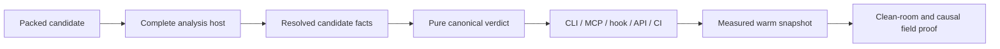

# Plan: Enforcement truth at speed

> **Plan (not SSOT implementation docs).** Hub: [AGENTS.md](../../../AGENTS.md) 
> Related: [ROADMAP Phase Z](../../../ROADMAP.md#phase-z--enforcement-truth-at-speed) ·
> [documentation audit](../../audit/claims-matrix.md) ·
> [analysis ownership](../../adr/0002-analysis-engine-ownership.md) ·
> [CLI bundle](../../adr/0003-cli-analysis-engine-bundle.md) ·
> [atomic preflight](../../adr/0005-atomic-change-preflight.md) ·
> [enforcement evidence ladder](../../adr/0008-enforcement-evidence-ladder.md)

**Status:** In progress 
**Slug:** `enforcement-truth-at-speed` 
**Kind:** epic / redesign 
**Owners:** product (Pedro) + library maintainers 
**Last updated:** 2026-07-19 
**Code path (existing):** package/release scripts, TypeScript host, canonical analysis Kernel,
generated CLI bundle, CLI/MCP/hook/ESLint adapters, onboarding assets, and evaluation harnesses

## Problem

ArkGate's self-hosted contract and test suite are green, but a post-3.7.0 first-principles audit
found that the installed product can tell different truths about the same candidate:

- a packed TypeScript 7 consumer can lose the promised JS-API fallback, while `--plan` reports
  `goal.met: true` without a completed analysis;
- atomic preflight's compiler-free graph does not resolve the aliases and workspace paths that the
  final TypeScript-backed CLI resolves;
- AICodeGate can add a same-layer path heuristic after the declared contract has allowed the edge;
- copied starters and managed skill upgrades do not always satisfy their documented clean-room
  journey;
- adoption, live-agent, and independent-review evidence does not currently measure every outcome
  named by the roadmap;
- each hook pays process startup and repeated project discovery, leaving the interaction loop far
  from the latency users experience as immediate.

These are not reasons to reopen shipped Phases T, U, or X. They are post-release regressions or
proof gaps against those phases' accepted invariants, and need one corrective phase with new IDs.

## Outcome

For one base tree, complete candidate, compiler inputs, and policy, every parity-capable supported
entry point uses one normalized fact set and returns one verdict. A retained lexical compatibility
mode reports incomplete when it lacks facts and never borrows that parity claim. An unavailable or
partial analysis is never reported as green. The invariant is proven from the packed artifact and
clean consumer journeys, then served from a measured incremental control plane fast enough to stay
in the write loop.

## Users & success

- **Primary users:** TypeScript teams using ArkGate through an agent, CLI, MCP, hook, ESLint, or CI;
  maintainers publishing the package and interpreting adoption evidence.
- **Success metrics:**
  - zero destructive cleanup outside tool-owned release directories and files;
  - zero false-green `goal.met`/valid verdicts when analysis is partial or unavailable;
  - 100% verdict/evidence agreement on the differential adapter corpus;
  - every documented starter/upgrade journey passes from the current packed artifact;
  - hook p95 <=65 ms at 10k files, earning the same-runner 10x claim; canonical resolved-facts
    analysis p95 <=50 ms with resolution explicitly excluded; resident doctor p95 <=500 ms, with a
    like-for-like warm baseline recorded before any doctor ratio is claimed;
  - a preregistered matrix spanning at least 12 pinned repositories, four hosts, and three package
    managers reaches protected green in >=5/6 (83.33%) of every cell, with every Adapt, false block,
    bypass, manual decision, and failed cell in the summary;
  - first-green time includes strict Ark, typecheck, and tests; unsuccessful cells are right-
    censored at a preregistered cap rather than removed;
  - at least eight consented adopter projects enter follow-up, with >=3/4 of the full cohort
    retaining required Ark enforcement at D30 and >=5/8 at D90; missing follow-up counts not retained.
- **Non-goals / out of scope:** runtime production hardening, new presets or skill names, polyglot
  analysis, transitive capability inference, general codemods, or an LLM-derived verdict.

## MVP scope

| Slice | In scope | Later / out |
|-------|----------|-------------|
| `Z01` | Tool-owned release cleanup with path and ownership guards | General filesystem sandbox |
| `Z02` | Packed TS5/6/7 compatibility and explicit analysis completeness | Native TS7 API adoption before it is stable |
| `Z03` | Decide the resolved-facts/API boundary and generated CLI seam | Implementing while the ownership decision is open |
| `Z04` | One resolved candidate-facts pipeline and differential adapter parity | Y09 dynamic-template advisory and Y10 transitive inference |
| `Z05` | Current tarball through every copied starter, package manager, start, preflight, imports, and strict CI | New onboarding archetypes |
| `Z06` | Managed-content upgrade identities and observed enforcement-state truth | General project-file synchronization |
| `Z07` | Warm incremental snapshot pilot and decomposed fast test path | Mandatory background daemon |
| `Z08` | Live-agent, causal/full-denominator, censored-failure, and mutation evidence | Productivity claims from success-only samples |
| `Z09` | External matrix, D30/D90 retained cohort, and independently signed close | Self-declared reviewer identity |

## Acceptance criteria

- [x] **A1 — Safe maintenance:** release verification rejects broad/unowned output targets and
  package isolation preserves unrelated tarballs.
- [x] **A2 — Analysis completeness is explicit:** public JSON distinguishes complete, partial,
  and unavailable analysis; only complete analysis may produce a satisfied architecture goal. The
  schema, exported types, CLI/MCP JSON, snapshots, docs, and tarball are semantically equivalent by
  contract/drift tests; copies generated from one source remain byte-identical.
- [x] **A3 — Distribution is the test subject:** Node/TypeScript/package-manager compatibility
  runs install the packed candidate and exercise full check as well as plan.
- [x] **A4 — Decision before implementation:** `Z03`/[ADR 0011](../../adr/0011-resolved-candidate-facts-boundary.md)
  selects an additive supplied-facts API: Tooling emits one versioned payload, DomainModel owns its
  neutral schema, and Kernel evaluates it synchronously. The existing lexical mode remains
  explicitly incomplete outside its envelope and excluded from parity; the generated CLI bundle
  consumes the same facts/verdict seam.
- [x] **A5 — One fact graph:** aliases, workspaces, project packages, symlinks, relative imports,
  deletes, and governed-scope classification feed one serializable candidate fact set.
- [x] **A6 — One verdict:** the parity-capable API, preflight, CLI, MCP, complete-patch hook,
  AICodeGate, ESLint where its envelope applies, and final CI agree on rule identity and evidence.
  A retained lexical compatibility API reports incomplete where it lacks facts. A resolved governed
  edge is decided by `ark.config.json`, including same-layer edges.
- [x] **A7 — Strict means complete:** parse-invalid or unresolved mandatory evidence fails closed
  at `--strict-merge`; interactive doctor may remain advisory but cannot call the file clean.
- [x] **A8 — Installed journey is executable:** every gallery starter is copied to a temporary
  directory, installed from the candidate tarball, and passes its documented commands on every
  supported package manager, including one deliberate violation.
- [x] **A9 — Managed means identity-proven:** upgrade refreshes only Ark-managed assets, reports
  stale/missing/customized/conflicted state, requires consent for conflicts, and doctor separates
  analyzed/configured/installed/active/bypassable/required truth. Required CI status remains
  `unverified` without provider evidence.
- [ ] **A10 — Speed is earned:** the resident/canonical pilot meets its separately named latency
  targets without a false green, stale snapshot, public-output drift, or mandatory-daemon
  dependency. Cold, one-shot-warm, and resident-warm doctor latencies are reported separately;
  only like-for-like ratios count.
- [ ] **A11 — Evidence is causal:** preregister >=24 held-out task pairs across >=6 repositories and
  three fixed seeds per arm in an immutable manifest that pins candidate/tarball digest, repository
  SHAs/lockfiles, toolchain, agent/model/config, prompts, grader, caps, exclusions, and seeds; arms
  differ only by the preregistered ArkGate intervention. The primary restricted-mean time-to-common-
  green ratio is <=0.80 with a paired 95% bootstrap upper bound <1.0, while completion regresses by
  no more than five percentage points. Failed cells are right-censored, all outcomes remain, and
  corrected paths have zero `NoCoverage` survivors. A losing hypothesis is published and the claim
  is removed, never re-scored.
- [ ] **A12 — Retention and independence are real:** across >=12 pinned repositories, four hosts,
  and three package managers, >=5/6 of every preregistered external cell is protected green; a
  cohort of >=8 retains enforcement at >=3/4 D30 and >=5/8 D90 over the entire denominator, with
  missing/disabled/downgraded/unrecorded follow-up counted not retained. Each project's immutable
  manifest records initial digest, repository SHA, required-status evidence, and every forward
  corrective upgrade without resetting the clock; a non-implementing reviewer reproduces the
  initial candidate and signs the longitudinal manifest.
- [ ] **A13 — Hard lines held:** the runtime stays experimental and separate, parked Y items remain
  parked until their own gates are met, and no release gate is weakened to close the phase.

## Proposed public surface (hypothesis)

| Kind | Surface | Notes |
|------|---------|-------|
| Analysis JSON | Required schema 1.2 `completeness: complete \| partial \| unavailable` | Settled by `Z02`; incomplete analysis forces a non-green result while legacy 1.0/1.1 consumer values remain source-compatible |
| Analysis input | Versioned resolved candidate facts | Settled by `Z03`/[ADR 0011](../../adr/0011-resolved-candidate-facts-boundary.md): Tooling emits one serializable facts payload, DomainModel owns its schema, and Kernel exposes named synchronous supplied-facts APIs; the lexical compatibility mode is excluded from parity |
| Existing CLI/MCP | `plan`, `preflight`, `ark_prepare_change`, hook, strict check | Reuse current names; no new command or skill basename |
| Performance | Warm project snapshot keyed by policy, compiler, and content identities | Opt-in pilot with the current one-shot path retained as fallback |
| Evidence | Corrected adoption/live-agent/release reports | Versioned reports; historical reports remain labeled historical rather than rewritten |

## Approach

1. Remove the destructive release footguns before changing the analyzer.
2. Make incomplete analysis an explicit non-green state and prove it from the tarball.
3. Decide the resolver/facts/public-API and generated-bundle seam; implementation cannot start while
   that ownership choice is open.
4. Extract module resolution and governed-scope facts at the selected boundary, then evaluate only
   those normalized facts in the pure engine.
5. Run every documented starter/package journey against that same packed artifact.
6. Make managed upgrade and observed enforcement state independently testable.
7. Cache the proven fact pipeline; never optimize a divergent path.
8. Repair causal/live-agent/mutation evidence with every failed cell retained.
9. Close longitudinal and independent proof without delaying completed corrective patches.

## Dependencies & risks

- **Depends on:** ArkGate 3.7.0 as the reproduced baseline; accepted ADRs 0002, 0003, 0005, and
  0008; the existing package/adoption/performance harnesses.
- **Blocked by:** `Z02`–`Z05` are closed; `Z06` is dependency-ready.
- **Risk — Kernel impurity:** resolving imports inside Kernel would violate the four-layer contract.
  **Kill switch:** keep TypeScript/filesystem in Tooling and pass only serializable facts.
- **Risk — cache false green:** stale invalidation is worse than current latency.
  **Kill switch:** retain one-shot execution and abandon the warm path after any differential miss.
- **Risk — daemon complexity:** process transport may cost more than it saves.
  **Kill switch:** the hook must meet the same-runner 65 ms target against its 683.761 ms baseline;
  canonical analysis-only must meet 50 ms and resident doctor 500 ms. Exact JSON/verdict parity must
  hold. The original 10 ms incremental target was retired after four exact-output designs showed the
  canonical evaluator alone at about 20 ms; it remains a future end-to-end resolver stretch and is
  never relabeled. Record like-for-like one-shot-warm doctor before claiming a doctor ratio.
- **Risk — benchmark theatre:** an eval can optimize its own fixtures.
  **Mitigation:** held-out tasks, packed artifacts, control arms, all failures in denominators, and
  independent identity evidence.

## Resolved decisions

1. `Z02`: schema 1.2 requires `complete | partial | unavailable`; partial or unavailable analysis
   cannot satisfy `goal.met` or produce a green strict verdict.
2. `Z03`: [ADR 0011](../../adr/0011-resolved-candidate-facts-boundary.md) selects additive,
   versioned supplied facts. Tooling resolves; DomainModel owns neutral facts; Kernel evaluates them
   synchronously. Existing supplied-content APIs remain named lexical compatibility surfaces and
   cannot claim parity when required facts are outside their envelope.
3. `Z07`: use the opt-in resident MCP for hook and doctor snapshots with one-shot fallback. The
   canonical benchmark times only reevaluation of immutable resolved facts; resolution and its
   validated oracle stay outside that timer. After four safe attempts, its target is 50 ms, not the
   unreachable 10 ms endpoint, and it carries no order-of-magnitude claim.

## Open decisions

1. `Z09`: which signed repository/review identity mechanism proves independence without introducing
   an org control plane.

## Relationship to retained work

- Phases T and U stay shipped. Phase Z restores their atomic-preflight and adapter-parity promises;
  it does not rewrite their historical rationale.
- Phase X has no pending item. Its real reshape pilot was superseded by the golden-consistent field
  decision recorded in Phase Y.
- `Y06`, `Y07`, `Y09`, and `Y10` remain parked. Alias resolution does not satisfy Y09's dynamic
  template gate, and direct dependency resolution does not satisfy Y10's transitive-demand gate.
- Runtime commit/durability semantics remain owned by
  [ADR 0004](../../adr/0004-runtime-package-isolation.md) and
  [production hardening](../../production-hardening.md); parked candidate `K01` retains the confirmed
  dependency-graph rollback, recording/enqueue, and hook-failure gaps outside the gate-product phase.

## Corrective release policy

- Repository truth warnings may merge immediately; npm's 3.7.0 readme remains stale until a
  corrective package is published.
- `Z01` + `Z02` may ship a stable corrective patch for safe release tooling, completeness truth,
  and packed TS compatibility without waiting for performance or D30/D90 evidence.
- `Z04` may ship adapter parity as a patch when its seam is internal. If `Z03` requires a new stable
  export/API, use an explicitly approved backward-compatible corrective minor (or canary), with no
  unrelated surface. `Z05` + `Z06` establish the clean installed/upgrade baseline.
- `Z07` gates only the verified 10x hook-latency claim and its named absolute targets. `Z08` +
  `Z09` gate causal productivity, retained adoption,
  independent-close, and epic-shipped claims—not already proven correctness fixes.

## Promotion

The implementation IDs are tracked in [ROADMAP Phase Z](../../../ROADMAP.md#phase-z--enforcement-truth-at-speed).
`Z01`–`Z05` are complete; subsequent promotion follows the same discipline:

1. Move only the next dependency-ready Z item to `doing` (`Z06` next).
2. Expose its failing acceptance cases before changing behavior.
3. Close the item-specific evidence and common merge gate on the same commit.
4. Advance one Z item at a time; do not promote the parked Y candidates as collateral work.
5. When `Z09` closes, mark this plan `Shipped`, retain it as rationale, and make the corrected
   reports/release notes the implementation evidence.

## Related

- Canonical queue and hard lines: [ROADMAP.md](../../../ROADMAP.md)
- Prior atomic-change rationale: [change-integrity-loop](../change-integrity-loop/README.md)
- Prior effect/legibility rationale: [understandable-execution](../understandable-execution/README.md)
- Runtime exclusion: [ADR 0004](../../adr/0004-runtime-package-isolation.md)
