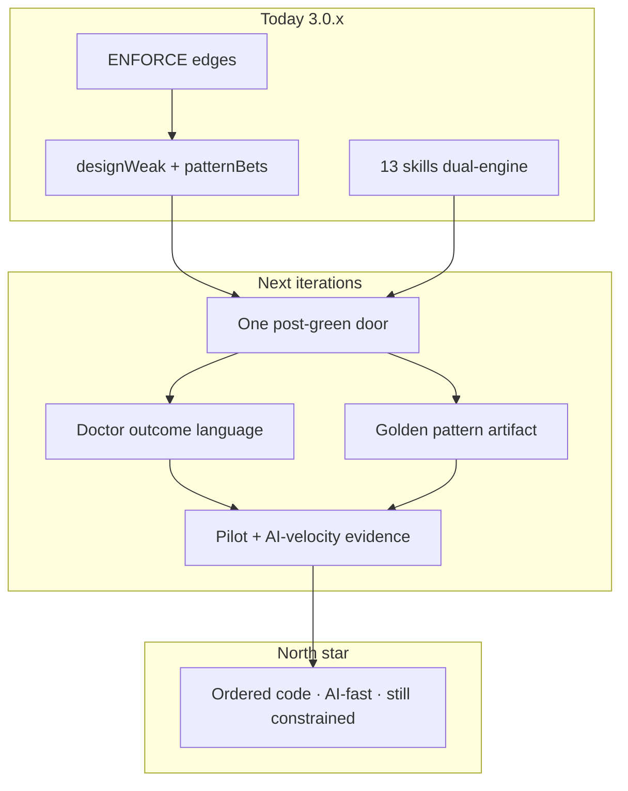

# Plan: Power + simple → AI-clear code (post–Phase P)

> **Plan (not SSOT implementation docs).** Library hub: [AGENTS.md](../../../AGENTS.md) 
> Related: [ROADMAP.md](../../../ROADMAP.md) · [package-surface.md](../../package-surface.md) · [brownfield-adoption.md](../../brownfield-adoption.md) · [README — Less spaghetti](../../../README.md#less-spaghetti-after-the-gate-is-green) 
> Durable decisions and accepted IDs were folded into `ROADMAP.md` when Phase Q shipped.

**Status:** Shipped 
**Slug:** `power-simple-shape` 
**Kind:** epic / product vision 
**Owners:** product (Pedro) + library maintainers 
**Last updated:** 2026-07-14 
**Code path (if any):** Phase Q surfaces ship in **arkgate@3.0.3** (post-green path, smell outcomes, golden pattern, pilot loop, AI-velocity eval) on top of Phase P (`design-smells`, `patternBets`, skills)

---

## Problem

ArkGate already delivers an **honest gate** (contract + write/CI + design-weak sensors). That is necessary and not sufficient for the product promise:

| Who | Pain today |
|-----|------------|
| **Dev** | Power exists (doctor JSON, plan B, 13 skills) but the **path to “organized for AI”** still feels like a staff workflow, not a first-class product mode. |
| **Vibecoder** | Setup + green edges are reachable; **false “done”** after empty plan A; Shape residual is easy to ignore. |
| **Newbie** | Too many names (layers, design-weak, patternBets, extraction cards) for “make my code good for the AI.” |
| **All** | **Enforced ≠ clear.** Green edges can still mean god modules, SQL in routes, concurrent patterns — slow, confusing AI work. |

**Why now:** Phase P (P01–P05) shipped the *engine* for design residual. The next iterations must turn that engine into a **single, dual-depth experience**: powerful for experts, one mental button for newcomers — ending in code that is **maintainable and AI-fast**, not only gate-green.

---

## Outcome

After the iterations in this plan:

1. **Newbie / vibecoder** can reach “edges honest + code clearer for AI” with **one post-green path** (no skill menu of 13), in plain language.
2. **Dev** keeps full depth (JSON IRs, smells, pilots, kill-switches) without a second product.
3. **New code** defaults to a **golden pattern** recorded in-repo; legacy is migrate-on-touch.
4. **Success is measurable:** fewer write-gate denials on happy-path features, lower design-weak residual on pilots, and faster agent feature loops on golden-path scaffolds — without weakening the gate.

One-line product north star:

> *A track so simple a newbie enters, so strict a dev trusts — and the AI ships faster because the design space is small and honest.*

---

## Users & success

### Primary users

| Persona | Job-to-be-done |
|---------|----------------|
| **Dev / tech lead** | Ratchet architecture debt; keep AI from re-spaghettifying; audit design-weak under ENFORCE. |
| **Vibecoder** | Agent stays in a safe, clear layout; green means progress toward “easy for AI,” not just no import errors. |
| **Newbie** | Follow one flow; understand status lights; get ordered structure without studying clean architecture. |

### Success metrics (falsifiable)

| Metric | Direction | Notes |
|--------|-----------|--------|
| Time-to-first **honest** doctor (Suggest→Adapt path) | ↓ | Cold `start` + doctor on gallery / thin tree |
| “False done” rate | ↓ | Share of sessions that stop at empty plan A while `designWeak` | 
| Design-weak residual on **pilot** after Shape pass | ↓ | Smell evidence paths cleared on pilot |
| Write-gate denials on golden-path feature add | ↓ | Same feature on starter before/after golden norm |
| Agent steps to land a scaffolded feature on golden path | ↓ | Eval / loop-cost style, not vanity LOC |
| Skill menu decisions for “code is messy” | → **1 primary path** | No requirement to pick among explore/coverage/think |

### Non-goals / out of scope

- General codemod engine or silent judgment auto-apply of plan B.
- New skill *names* as the default fix (prefer **one product path** over skill sprawl).
- Runtime kernel as the wedge; polyglot; org control-plane.
- Claiming “epic architecture” from type-only mechanical-safe cleanup alone.
- Lowering gate strictness to feel simpler.
- Full documentation-manager integration as a hard dependency of arkgate.

---

## MVP scope (iterations)

| In MVP (next iterations) | Later / out |
|--------------------------|-------------|
| **One post-green product path** (“Shape” / “clarify for AI”) that chains map → B → pilot without skill shopping | Multi-week auto migration |
| Doctor **outcome language** for top smells (human + JSON stable ids) | Full NLP of every smell |
| **Golden pattern artifact** in consumer repo (norm for new code) consumed by place / prepare-write / skills | Org-wide multi-repo policy cloud |
| Default routing: stuck-on-messy → single path | Replacing compact router |
| Eval: ENFORCE+design-weak already exists; extend with **golden-path feature speed** smoke | Large public adoption re-matrix every release |
| Site + README already started; keep **one phrase** everywhere | Marketing microsites per persona |
| Roadmap Phase **Q** items derived from this plan | Preset / policy-pack explosion |

---

## Acceptance criteria (epic-level)

[ROADMAP Phase Q](../../../ROADMAP.md) records Q01–Q06 as `done`; the
[3.0.3 release evidence](../../releases/3.0.3.md) maps Q01–Q05 to the shipped doctor, plan,
golden-pattern, pilot-loop, and fixed-fixture evaluation surfaces.

- [x] **A1 — Dual depth, one door:** Newbie-facing path has ≤1 primary skill/command for “make code clearer for AI after green”; dev depth remains via `--json` / existing skills without new basenames unless justified by kill-switch.
- [x] **A2 — No false done:** Doctor and plan cannot be summarized as “healthy finished” when `designWeak` or non-empty `patternBets`; the default agent flow and site preserve that distinction.
- [x] **A3 — Golden norm:** Consumer repo can persist a golden pattern (config, origin, or small artifact) that placement and agent guidance copy for *new* files.
- [x] **A4 — Pilot success:** At least one documented pilot flow (fixture or gallery) goes design-weak → extraction card → reduced smell on pilot with gate still strict.
- [x] **A5 — AI velocity claim is evidence-backed:** At least one eval or bench shows fewer denials or fewer agent steps on golden-path vs design-weak fixture for the same feature prompt.
- [x] **A6 — Hard lines held:** No new mechanical-safe kinds for Shape; no silent B apply; no gate weakening; ROADMAP still one-`doing`-at-a-time when implementing.

---

## Proposed public surface (hypothesis)

| Kind | Surface | Notes |
|------|---------|-------|
| CLI / doctor | `ark-check --doctor` human + JSON | Outcome blurbs for design-weak; keep ids stable |
| CLI / plan | `ark-check --plan --json` → `patternBets` | Already shipped; productize consumption in default skill path |
| Agent path | Single “Shape / clarify for AI” entry (skill *flow* or doctor next-action, not necessarily new name) | Prefer routing/autopilot over `ark-shape` name unless UX demands it |
| Config / repo artifact | Golden pattern pointer (TBD: field in config vs `.ark/` vs AGENTS norm) | Must be fail-closed and optional for greenfield |
| Docs / site | One north-star phrase + post-green path | README + arkgate-site already partial |
| Eval | Extend `design-weak-enforce` + golden-path speed smoke | No invented endpoints |

*Do not invent new npm major APIs until ADR locks the golden-norm storage.*

---

## Approach (short)

Build **on Phase P**, not a rewrite.

### Iteration map (proposed ROADMAP Phase **Q** — *not started until approved*)

| Order | ID | Size | Outcome | Depends |
|---:|---|---:|---|---|
| 1 | `Q01` | M | **done** — Single post-green path in doctor top-action + skill routing: “clarify for AI / Shape” without skill shopping | Phase P done |
| 2 | `Q02` | S | **done** — Human outcome language for top design smells (and docs parity) | Q01 |
| 3 | `Q03` | M | **done** — Golden pattern artifact (`.ark/golden-pattern.json`) + place/prepare-write/doctor read it for *new* code | Q01 |
| 4 | `Q04` | M | **done** — Pilot loop productized: extraction card → one pilot → re-doctor; fixture proof | Q02, Q03 |
| 5 | `Q05` | M | **done** — AI-velocity evidence: eval/bench golden-path vs design-weak for same feature prompt | Q04 |
| 6 | `Q06` | S | **done** — Release + surfaces: package-surface, agent-guide, CHANGELOG, `docs/releases/3.0.3.md`, version 3.0.3 | Q01–Q05 as needed |

Implementation rules (carry forward from ROADMAP):

- One item `doing` at a time once folded into `ROADMAP.md`.
- Common merge gate unchanged.
- Prefer additive JSON within major; no false ENFORCE claims.

### Design principles for the iterations

1. **Limit to accelerate** — constraints that shrink the AI’s search space are the product, not a tax.
2. **Dual depth, one door** — power in JSON/flags; simplicity in next-action + one path.
3. **Enforce then Shape** — never skip honest edges to chase pretty folders.
4. **Pilot > big-bang** — extraction cards, kill-switches, migrate-on-touch.
5. **Code wins** — docs/plans do not override sensors; sensors do not claim design beauty without smells/B.

---

## Dependencies & risks

### Depends on

- Phase P complete (P01–P05) — **done**.
- Published 3.0.1+ (designFitness / patternBets / skills) — **done** (3.0.2 docs patch).
- Hard lines: no silent B, no general codemod, no gate weakening.

### Risks

| Risk | Mitigation |
|------|------------|
| New skill name sprawl (`/ark-shape`) confuses more | Prefer doctor next-action + autopilot/explore routing first; name only if UX test fails |
| Golden pattern becomes another false-green | Optional artifact; empty = no claim; never mark ENFORCE from golden text alone |
| Newbie path hides power so devs leave | Always expose `--json` and advanced skill table; never remove depth |
| AI-velocity metric is gamed | Use fixed prompt + fixture trees; publish method next to number |
| Scope creep into runtime / presets | Freeze list in non-goals; kill-switch: drop Q-item if it needs new preset pack |

### Q03 storage decision (locked)

**Chosen:** `.ark/golden-pattern.json` side-car (not a new `ark.config.json` field).
Rationale: optional consumer artifact under existing local-state convention; no schema
churn; absence is normal; never gates ENFORCE. Fields: `name` + `norm` required;
`newCodeHome`, `examplePath`, `schemaVersion` optional.

### Decisions closed by Phase Q

| Decision | Shipped answer |
|---|---|
| Golden-pattern storage | Project-local `.ark/golden-pattern.json`. |
| Product entry point | `doctor` exposes `clarify-for-ai` and routes into the existing exploration flow. |
| Skill surface | Existing skills were reused; no new public skill basename was introduced. |
| AI-velocity evidence | A deterministic fixed-fixture evaluation was added without live-model scoring. |

---

## Questions closed by Phase Q

- No gallery starter became a second source of truth; the fixed fixture owns the comparison scenario.
- Compact `ark start` stayed focused, while `doctor` owns discovery of the post-green Shape path.
- The first playbook shipped in English; locale-aware rendering remained outside Phase Q.

---

## Promotion completed

Completion record:

1. Q01–Q06 were folded into the `ROADMAP.md` ordered queue and completed sequentially.
2. Golden-pattern storage was locked as `.ark/golden-pattern.json`; no new public skill name was added.
3. Stable surfaces were documented in [package-surface.md](../../package-surface.md), consumer docs, and release notes.
4. No separate feature pack was needed; roadmap evidence and release notes own the shipped CLI/skill slices.
5. This plan is now **Shipped** and retained as epic rationale.

**Status (2026-07-13):** Phase Q **Shipped and published** in package **3.0.3**.

---

## Related

- Phase P closed: design smells, patternBets, extraction cards, skill routing (`ROADMAP.md` Phase P).
- Product honesty: [README Less spaghetti](../../../README.md#less-spaghetti-after-the-gate-is-green) · arkgate-site `#shape`.
- Sensors: `bin/lib/design-smells.mjs`, `bin/lib/doctor-plan.mjs`.
- Hard lines: [ROADMAP.md](../../../ROADMAP.md) product mandate / freeze list.
- Optional narrative multi-PR: brownfield-adoption §6 durable Shape plan.

---

## Appendix — vision traceability

| Vision claim | Plan lever |
|--------------|------------|
| Potente para un dev | Keep JSON IRs, skills depth, no dumbing down of gate |
| Fácil para un newbie | Q01 one door + Q02 outcome language |
| Código enforced | Already; never regress |
| Ordenado / claro / mantenible | Q03 golden + Q04 pilots |
| Limitado para la IA y más rápido | Q03 + Q05 velocity evidence |
| Desde cero o reparado | start/adopt remain; Shape after ENFORCE; greenfield golden by default |

---

*End of shipped epic rationale. Phase Q implementation authority and evidence remain in `ROADMAP.md`.*
