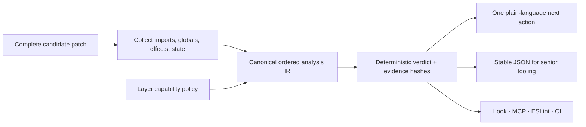

# Plan: Understandable execution — explicit effects, legible core

> **Plan (not SSOT implementation docs).** Library hub: [AGENTS.md](../../../AGENTS.md) 
> Related: [ROADMAP.md](../../../ROADMAP.md) · [analysis-engine ownership](../../adr/0002-analysis-engine-ownership.md) · [CLI bundle](../../adr/0003-cli-analysis-engine-bundle.md) · [change integrity](../change-integrity-loop/README.md) 
> Implementation remains governed by `ROADMAP.md`; this plan records the epic rationale and
> boundaries.

**Status:** Closed — shipped in `arkgate@3.4.0` (2026-07-16) 
**Slug:** `understandable-execution` 
**Kind:** epic / redesign 
**Owners:** product (Pedro) + library maintainers 
**Last updated:** 2026-07-17 
**Code path (existing):** `src/domain/configContract.ts`, `src/kernel/analysis.ts`, generated analysis bundle, CLI/MCP/ESLint/hook adapters

---

## Problem

ArkGate already blocks invalid architecture deterministically, but two kinds of hidden complexity
remain relevant to its product promise:

1. Effects such as network, filesystem, time, randomness, environment, process access, and
   persistence are only partially modeled through imports and `forbiddenGlobals`. A boundary may
   be import-clean while still depending on ambient behavior that is hard for a human or agent to
   reason about.
2. ArkGate's own canonical contract and analysis modules are reported as `god-module` candidates by
   its shipped doctor, while several Tooling entrypoints operate near their LOC budgets. Splitting
   blindly would replace local flow with call-site hopping; doing nothing would keep concentrating
   responsibilities.

The useful lesson from John Carmack's later clarification is not mandatory inlining. It is that
unexpected dependency and mutation are the real enemies, and pure functions solve those problems
more directly. ArkGate should translate that into architectural evidence, not a general coding
style doctrine.

## Outcome

ArkGate can describe and constrain important effects and ambient state as deterministic
architecture capabilities. A casual user receives one concrete instruction such as “inject a
Clock port”; a senior receives stable capability IDs, source evidence, hashes, and adapter-parity
results. The library dogfoods the same philosophy through cohesive pure modules and thin effect
boundaries without changing its public API merely to reduce LOC.

## Users & success

### Primary users

| User | Job to be done |
|---|---|
| Senior / architect | Define which layers may perform effects and audit exact evidence across adapters |
| Agent-assisted developer | Reject hidden effects before a proposed patch is written or merged |
| Vibecoder / casual user | Understand why ambient time, I/O, or global state is risky and get one safe next move |
| ArkGate maintainer | Keep the enforcement path understandable without introducing scanner or helper sprawl |

### Success metrics

| Metric | Required direction |
|---|---|
| Canonical IR/verdict drift across CLI, MCP, ESLint, hooks, and package API | Zero |
| False-positive blockers on the fixed capability/adoption corpus | Zero before a rule becomes strict |
| Self-hosted deterministic design-smell evidence | The named canonical candidates clear after their individual pilots |
| Public API/schema compatibility during internal pilots | No unplanned breaking change |
| Complete-patch preflight | Same capability verdict and evidence as final strict CI for the same candidate |
| End-to-end hook/MCP preflight latency and memory | Baseline first; then a fixed CI budget with measured runner headroom |
| Package/module budgets | No item-by-item ceiling ratchet; stay within the roadmap-cycle guardrails |

### Non-goals / out of scope

- No “Carmack mode”, style score, trust score, or branding dependency.
- No mandatory inlining of single-use helpers, maximum function length, class ban, naming rule, or
  blanket `const` lint.
- No rewrite from scratch, language migration, data-oriented layout without profiling, or broad
  performance optimization.
- No new preset pack, skill basename, runtime feature, general codemod, or LLM-derived verdict.
- No automatic extraction of judgment-heavy code. Internal and consumer Shape changes remain
  one-pilot-at-a-time with a kill-switch.

## MVP scope

| In MVP | Later / out |
|---|---|
| Typed capability vocabulary and evidence in the canonical analysis IR | Polyglot or framework-specific effect systems |
| Layer policy for supported effects with backwards-compatible `forbiddenGlobals` behavior | Arbitrary user-authored semantic plugins in the gate core |
| Advisory ambient-state sensor with a fixed false-positive corpus | Strict ambient-state blocking before evidence supports it |
| Dual-depth remediation using ports/adapters | Automatic port/interface generation |
| Separate self-hosted cohesion pilots for the named candidates | Repo-wide file splitting or CLI rewrite |
| End-to-end pre-tool/MCP benchmark and fixed budget | Micro-optimizations without profiles |

## Acceptance criteria

- [x] **A1 — Boundary, not style:** an accepted ADR defines supported capability/state semantics,
  compatibility, non-goals, and the evidence required before a diagnostic can block —
  [ADR 0009](../../adr/0009-effect-capability-boundary.md) (Accepted 2026-07-16) plus the
  `capability-corpus` fixtures and structural guard.
- [x] **A2 — Honest dogfood:** the named self-hosted god-module candidates are handled as
  separate pilots; each preserves public behavior and stops if coupling or call-site hopping grows
  — U02 shipped both pilots (type-vocabulary split + C02 facade over cohesive kernel modules)
  with byte-identical config artifacts, zero consumer import changes, and self-doctor reporting
  zero design smells.
- [x] **A3 — Canonical effect evidence:** identical files, compiler inputs, and policy yield the
  same ordered capability uses, violations, hashes, and remediation IDs through the canonical IR
  (U03 determinism cases against the frozen corpus).
- [x] **A4 — Atomic enforcement:** a multi-file candidate cannot hide a newly introduced denied
  capability; pre-tool/MCP preflight and final CI agree on the complete patch (U04 pinned the
  multi-file case; U06 wired the real hook).
- [x] **A5 — Ambient state earns strictness:** module-scope mutable-state findings remain advisory
  until the fixed corpus proves blocker-grade precision and an explicit layer policy opts in —
  U05 shipped the sensor advisory-only, opt-in via `pure: true` layers, with sidecar acks and no
  strict option anywhere.
- [x] **A6 — Dual depth:** every rejection has one plain-language next action and stable JSON
  evidence; no model interpretation decides pass/fail — CAPABILITY_VIOLATION carries FIX_HINTS +
  suggestion (casual) and ruleId/capability/fixClass/nextAction (JSON) across CLI, hook, MCP,
  preflight, and ESLint.
- [x] **A7 — Profile before optimize:** end-to-end hook and MCP paths have reproducible cold and
  incremental measurements before fixed budgets or optimizations are approved — the hook-path
  bench measures complete child-process paths; ceilings land only from the recorded Linux
  baseline (record mode until then), and no optimization shipped without a profile.
- [x] **A8 — Hard lines held:** no weakened gate, new skill namespace, general codemod, runtime
  wedge, package-budget ratchet, or breaking API hidden inside the redesign — verified across
  U01–U07: every new surface is opt-in/advisory, budgets were met by extraction (never raised),
  and the only classification change (D6 coverage atoms) STRENGTHENS the acknowledgment guard.

## Shipped public surface

| Kind | Surface | Status / notes |
|---|---|---|
| Analysis IR | Ordered typed `capabilityUses` evidence | Shipped additively in Analysis IR `1.0` |
| Config | Per-layer `capabilities.deny` and `pure: true` | Shipped opt-in; absence preserves previous behavior |
| CLI / MCP | Existing check, doctor, prepare-write, and atomic preflight responses | Shipped through existing commands/tools; no new basename |
| ESLint / hooks | Existing adapters over the same verdict vocabulary | Shipped with cross-adapter capability verdict parity |
| Human remediation | “Define a Clock/Random/HTTP/storage port and bind it outside the pure layer” | Stable next-action IDs; judgment-class and never auto-applied |
| Ambient state | Advisory finding for opted-in pure layers | Shipped doctor-only with sidecar acknowledgments; no strict mode |

The durable boundary and compatibility decisions are locked in
[ADR 0009](../../adr/0009-effect-capability-boundary.md) (Accepted); canonical consumer details
live in the configuration, package-surface, and agent-guide documents.

## Approach

### Iteration map

| Order | ID | Size | Outcome | Depends on |
|---:|---|---:|---|---|
| 1 | `U01` | S | Lock the architecture-vs-style boundary, capability vocabulary, compatibility, and fixed corpus in an ADR | Phase T shipped |
| 2 | `U02` | M | Dogfood separate cohesive pure-core pilots without public API or verdict drift | `U01` |
| 3 | `U03` | L | Add typed effect capability evidence to the canonical IR and generated CLI bundle | `U01`, `U02` (soft) |
| 4 | `U04` | L | Enforce opted-in layer capability walls in complete-patch preflight with full adapter parity | `U03` |
| 5 | `U05` | M | Add an advisory ambient mutable-state sensor and prove its precision before any strict option | `U03` |
| 6 | `U06` | M | Ship dual-depth remediation and end-to-end pre-tool/MCP performance budgets | `U04`, `U05` |
| 7 | `U07` | S | Run adoption/release evidence, documentation parity, package checks, and release readiness | `U01`–`U06` |

U01–U07 were promoted into `ROADMAP.md` and completed one `doing` item at a time. Every behavioral
item started with a failing fixture or measured baseline, preserved the canonical engine, and ran
the common merge gate.

**U02 is a hygiene dependency, not a logic one.** Splitting the named modules first reduces U03's
merge surface, but U03 does not require the split: if a U02 pilot's kill-switch fires (coupling or
call-site hopping grows), record the outcome as that pilot's evidence and start U03 anyway — a
cosmetic pilot must never hold the phase hostage.

**Release slicing (owner decision 2026-07-15):** Phase U shipped in two stable minors because the
L+L middle concentrated wall-clock risk: `U01–U03` first in 3.3.0 (advisory capability evidence
in the IR, no enforcement), then `U04–U07` in 3.4.0 (opted-in walls, ambient-state sensor,
budgets, and release evidence). This followed the Phase W advisory-first pattern.

## Dependencies & risks

### Depends on

- Phase T and `arkgate@3.1.0` complete.
- ADR 0002/0003 ownership: one Kernel analysis source and one checked CLI bundle.
- Existing symbol-aware scanning, atomic candidate preflight, adapter parity, deterministic hashes,
  design-smell pilots, and roadmap-cycle package budgets.

### Risks and mitigations

| Risk | Mitigation |
|---|---|
| Becomes a generic code-quality linter | Only model effects/state that change architectural reasoning; leave local style to TypeScript/ESLint |
| Capability names or defaults make config harder for casual users | Optional/backwards-compatible surface; existing starters and human remediation hide depth without hiding evidence |
| Ambient-state detection flags legitimate caches/registries | Advisory first, explicit pure-layer opt-in, fixed negative corpus, strictness requires a later evidence decision |
| Internal splitting creates helper sprawl | Cohesive responsibility seams, exact public parity, one pilot at a time, kill-switch on increased call hopping/coupling |
| Generated bundle or adapter verdicts drift | Existing drift gate plus exact cross-adapter capability fixtures |
| Pre-tool path becomes slower | Measure complete path first; optimize only repeated parsing/scanning shown by profiles |
| Package grows beyond the cycle ceiling | Reuse existing IR/adapters; measure candidate contents; remove duplicated surface before requesting an exception |

## Decisions closed by U01

[ADR 0009](../../adr/0009-effect-capability-boundary.md) is **Accepted**; its fixture obligations
were met by the capability corpus and structural guard.

| Decision | Accepted answer |
|---|---|
| D1 — vocabulary / IR | Seven fixed capability IDs; additive analysis IR extension. |
| D2 — config | `forbiddenGlobals` and capability policy lower to one semantic space; `pure: true` is the casual surface. |
| D3 — blocking | Direct evidence may block; transitive inference never blocks in Phase U. |
| D4 — ambient state | Doctor-only through U07, with reasoned `.ark/` sidecar acknowledgments. |
| D5 — performance | Record the Linux baseline first, then set fixed-headroom ceilings; no per-item ratchet. |
| D6 — policy delta | Compare lowered coverage atoms so equivalent migrations are neutral and real losses are weakening. |
| D7 — surface ownership | Declared edges, capabilities, design smells, and contract smells each own one question; duplicate evidence emits one voice. |
| D8 — governance weight | Capability policies are reported facts, not edge-rule counts used for the governance band. |

## Closure

Promotion and implementation are complete:

1. U01–U07 moved through the ordered roadmap one active item at a time and are `done`.
2. U01 decisions were promoted to accepted ADR 0009 before enforcement shipped.
3. Canonical package, config, agent, and release docs were updated with the real surfaces.
4. Acceptance criteria were closed from fixture, adapter-parity, benchmark, and release evidence.
5. U07 closed in `arkgate@3.4.0`; this plan remains as shipped rationale rather than implementation authority.

## Related

- [ROADMAP.md](../../../ROADMAP.md)
- [AGENTS.md](../../../AGENTS.md)
- [ADR 0002 — analysis engine ownership](../../adr/0002-analysis-engine-ownership.md)
- [ADR 0003 — CLI analysis engine bundle](../../adr/0003-cli-analysis-engine-bundle.md)
- [ADR 0005 — atomic change preflight](../../adr/0005-atomic-change-preflight.md)
- [Phase T plan](../change-integrity-loop/README.md)
- [Carmack on inlined code and functional programming](https://number-none.com/blow/john_carmack_on_inlined_code.html)
