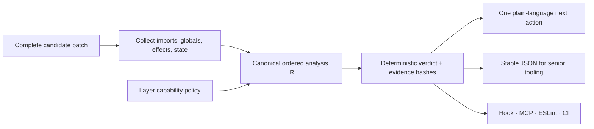

# Plan: Understandable execution — explicit effects, legible core

> **Plan (not SSOT implementation docs).** Library hub: [AGENTS.md](../../../AGENTS.md) 
> Related: [ROADMAP.md](../../../ROADMAP.md) · [analysis-engine ownership](../../adr/0002-analysis-engine-ownership.md) · [CLI bundle](../../adr/0003-cli-analysis-engine-bundle.md) · [change integrity](../change-integrity-loop/README.md) 
> Implementation remains governed by `ROADMAP.md`; this plan records the epic rationale and
> boundaries.

**Status:** Planned 
**Slug:** `understandable-execution` 
**Kind:** epic / redesign 
**Owners:** product (Pedro) + library maintainers 
**Last updated:** 2026-07-15 
**Code path (existing):** `src/domain/configContract.ts`, `src/kernel/analysis.ts`, generated analysis bundle, CLI/MCP/ESLint/hook adapters

---

## Problem

ArkGate already blocks invalid architecture deterministically, but two kinds of hidden complexity
remain relevant to its product promise:

1. Effects such as network, filesystem, time, randomness, environment, process access, and
   persistence are only partially modeled through imports and `forbiddenGlobals`. A boundary may
   be import-clean while still depending on ambient behavior that is hard for a human or agent to
   reason about.
2. ArkGate's own canonical contract and analysis modules are reported as `god-module` candidates by
   its shipped doctor, while several Tooling entrypoints operate near their LOC budgets. Splitting
   blindly would replace local flow with call-site hopping; doing nothing would keep concentrating
   responsibilities.

The useful lesson from John Carmack's later clarification is not mandatory inlining. It is that
unexpected dependency and mutation are the real enemies, and pure functions solve those problems
more directly. ArkGate should translate that into architectural evidence, not a general coding
style doctrine.

## Outcome

ArkGate can describe and constrain important effects and ambient state as deterministic
architecture capabilities. A casual user receives one concrete instruction such as “inject a
Clock port”; a senior receives stable capability IDs, source evidence, hashes, and adapter-parity
results. The library dogfoods the same philosophy through cohesive pure modules and thin effect
boundaries without changing its public API merely to reduce LOC.

## Users & success

### Primary users

| User | Job to be done |
|---|---|
| Senior / architect | Define which layers may perform effects and audit exact evidence across adapters |
| Agent-assisted developer | Reject hidden effects before a proposed patch is written or merged |
| Vibecoder / casual user | Understand why ambient time, I/O, or global state is risky and get one safe next move |
| ArkGate maintainer | Keep the enforcement path understandable without introducing scanner or helper sprawl |

### Success metrics

| Metric | Required direction |
|---|---|
| Canonical IR/verdict drift across CLI, MCP, ESLint, hooks, and package API | Zero |
| False-positive blockers on the fixed capability/adoption corpus | Zero before a rule becomes strict |
| Self-hosted deterministic design-smell evidence | The named canonical candidates clear after their individual pilots |
| Public API/schema compatibility during internal pilots | No unplanned breaking change |
| Complete-patch preflight | Same capability verdict and evidence as final strict CI for the same candidate |
| End-to-end hook/MCP preflight latency and memory | Baseline first; then a fixed CI budget with measured runner headroom |
| Package/module budgets | No item-by-item ceiling ratchet; stay within the roadmap-cycle guardrails |

### Non-goals / out of scope

- No “Carmack mode”, style score, trust score, or branding dependency.
- No mandatory inlining of single-use helpers, maximum function length, class ban, naming rule, or
  blanket `const` lint.
- No rewrite from scratch, language migration, data-oriented layout without profiling, or broad
  performance optimization.
- No new preset pack, skill basename, runtime feature, general codemod, or LLM-derived verdict.
- No automatic extraction of judgment-heavy code. Internal and consumer Shape changes remain
  one-pilot-at-a-time with a kill-switch.

## MVP scope

| In MVP | Later / out |
|---|---|
| Typed capability vocabulary and evidence in the canonical analysis IR | Polyglot or framework-specific effect systems |
| Layer policy for supported effects with backwards-compatible `forbiddenGlobals` behavior | Arbitrary user-authored semantic plugins in the gate core |
| Advisory ambient-state sensor with a fixed false-positive corpus | Strict ambient-state blocking before evidence supports it |
| Dual-depth remediation using ports/adapters | Automatic port/interface generation |
| Separate self-hosted cohesion pilots for the named candidates | Repo-wide file splitting or CLI rewrite |
| End-to-end pre-tool/MCP benchmark and fixed budget | Micro-optimizations without profiles |

## Acceptance criteria

- [ ] **A1 — Boundary, not style:** an accepted ADR defines supported capability/state semantics,
  compatibility, non-goals, and the evidence required before a diagnostic can block.
- [ ] **A2 — Honest dogfood:** the named self-hosted god-module candidates are handled as
  separate pilots; each preserves public behavior and stops if coupling or call-site hopping grows.
- [ ] **A3 — Canonical effect evidence:** identical files, compiler inputs, and policy yield the
  same ordered capability uses, violations, hashes, and remediation IDs through the canonical IR.
- [ ] **A4 — Atomic enforcement:** a multi-file candidate cannot hide a newly introduced denied
  capability; pre-tool/MCP preflight and final CI agree on the complete patch.
- [ ] **A5 — Ambient state earns strictness:** module-scope mutable-state findings remain advisory
  until the fixed corpus proves blocker-grade precision and an explicit layer policy opts in.
- [ ] **A6 — Dual depth:** every rejection has one plain-language next action and stable JSON
  evidence; no model interpretation decides pass/fail.
- [ ] **A7 — Profile before optimize:** end-to-end hook and MCP paths have reproducible cold and
  incremental measurements before fixed budgets or optimizations are approved.
- [ ] **A8 — Hard lines held:** no weakened gate, new skill namespace, general codemod, runtime
  wedge, package-budget ratchet, or breaking API hidden inside the redesign.

## Proposed public surface (hypothesis)

| Kind | Surface | Status / notes |
|---|---|---|
| Analysis IR | Ordered typed capability-use evidence | TBD in U01; additive/schema-version decision required |
| Config | Layer-level allow/deny capability policy | TBD in U01; absence must preserve current behavior |
| CLI / MCP | Existing check, doctor, prepare-write, and atomic preflight responses | Reuse existing commands/tools; no new basename |
| ESLint / hooks | Existing adapters over the same verdict vocabulary | Adapter-native collection may remain, verdict parity is mandatory |
| Human remediation | “Define a Clock/Random/HTTP/storage port and bind it outside the pure layer” | Stable next-action IDs; no automatic judgment apply |
| Ambient state | Advisory finding for opted-in pure layers | Strict mode is a later evidence decision, not assumed |

No public name or schema is locked by this plan. U01 owns those decisions and promotes durable
answers to an ADR before implementation.

## Approach

### Iteration map

| Order | ID | Size | Outcome | Depends on |
|---:|---|---:|---|---|
| 1 | `U01` | S | Lock the architecture-vs-style boundary, capability vocabulary, compatibility, and fixed corpus in an ADR | Phase T shipped |
| 2 | `U02` | M | Dogfood separate cohesive pure-core pilots without public API or verdict drift | `U01` |
| 3 | `U03` | L | Add typed effect capability evidence to the canonical IR and generated CLI bundle | `U01`, `U02` |
| 4 | `U04` | L | Enforce opted-in layer capability walls in complete-patch preflight with full adapter parity | `U03` |
| 5 | `U05` | M | Add an advisory ambient mutable-state sensor and prove its precision before any strict option | `U03` |
| 6 | `U06` | M | Ship dual-depth remediation and end-to-end pre-tool/MCP performance budgets | `U04`, `U05` |
| 7 | `U07` | S | Run adoption/release evidence, documentation parity, package checks, and release readiness | `U01`–`U06` |

One item may be `doing` at a time after promotion into `ROADMAP.md`. Every behavioral item starts
with a failing fixture or measured baseline, preserves the canonical engine, and runs the common
merge gate.

## Dependencies & risks

### Depends on

- Phase T and `arkgate@3.1.0` complete.
- ADR 0002/0003 ownership: one Kernel analysis source and one checked CLI bundle.
- Existing symbol-aware scanning, atomic candidate preflight, adapter parity, deterministic hashes,
  design-smell pilots, and roadmap-cycle package budgets.

### Risks and mitigations

| Risk | Mitigation |
|---|---|
| Becomes a generic code-quality linter | Only model effects/state that change architectural reasoning; leave local style to TypeScript/ESLint |
| Capability names or defaults make config harder for casual users | Optional/backwards-compatible surface; existing starters and human remediation hide depth without hiding evidence |
| Ambient-state detection flags legitimate caches/registries | Advisory first, explicit pure-layer opt-in, fixed negative corpus, strictness requires a later evidence decision |
| Internal splitting creates helper sprawl | Cohesive responsibility seams, exact public parity, one pilot at a time, kill-switch on increased call hopping/coupling |
| Generated bundle or adapter verdicts drift | Existing drift gate plus exact cross-adapter capability fixtures |
| Pre-tool path becomes slower | Measure complete path first; optimize only repeated parsing/scanning shown by profiles |
| Package grows beyond the cycle ceiling | Reuse existing IR/adapters; measure candidate contents; remove duplicated surface before requesting an exception |

## Open decisions owned by U01

1. Capability IDs and whether they extend Analysis IR `1.0` additively or require a version change.
2. Config shape and migration relationship with existing `forbiddenGlobals`.
3. Which imports/globals are blocker-grade in the first corpus and which remain advisory.
4. Whether ambient-state policy belongs in MVP config or remains doctor-only through U07.
5. Exact end-to-end benchmark scenarios and thresholds after the Linux baseline is recorded.

## Promotion

This epic is already linked into the ordered roadmap. When implementation begins:

1. Move only the active U-item from `todo` to `doing`.
2. Promote locked U01 decisions to the next ADR number; do not treat this plan as the contract.
3. Update canonical package/config/agent docs only when a real public surface lands.
4. Mark acceptance criteria from CI evidence, not from stubs or prose.
5. Mark this plan `Shipped` after U07 and retain it as rationale; create a feature pack only if a
   distinct long-lived public capability module needs its own implementation authority.

## Related

- [ROADMAP.md](../../../ROADMAP.md)
- [AGENTS.md](../../../AGENTS.md)
- [ADR 0002 — analysis engine ownership](../../adr/0002-analysis-engine-ownership.md)
- [ADR 0003 — CLI analysis engine bundle](../../adr/0003-cli-analysis-engine-bundle.md)
- [ADR 0005 — atomic change preflight](../../adr/0005-atomic-change-preflight.md)
- [Phase T plan](../change-integrity-loop/README.md)
- [Carmack on inlined code and functional programming](https://number-none.com/blow/john_carmack_on_inlined_code.html)
